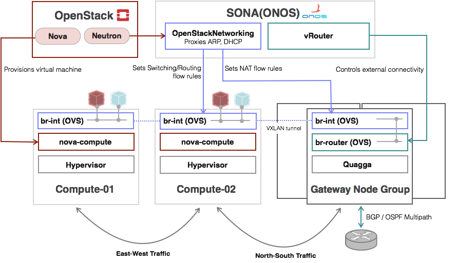

****************************
TACO OpenStack 네트워크 구조
****************************

TACO 네트워크 Overview
======================

TACO는 OpenStack의 Community Version을 기반으로 하기 때문에 기본적으로는 OpenStack에서 제공하는 모든 종류의 네트워크 드라이버와 토폴로지를 지원할 수 있지만, 이번 릴리즈에서는 실질적인 구축 사례를 고려해 아래의 세 가지의 네트워크 모드를 선정하고 설정 및 검증을 진행했다. 

* Provider Networks Only 모드
* Self-Service Networks 모드
* SONA 모드

위의 세 가지 옵션들 중에서 어떤 네트워크 모드를 선택할 지는 구축의 규모와 용도에 따라 결정된다 (표 1 참조).

예를 들어, 구축의 규모가 크지 않다면 FLAT 혹은 VLAN 같은 네트워크 타입을 선택하는 것이 효과적이다. 반면에 구축의 규모가 크거나 향후 규모가 증가할 가능성이 높다면 VXLAN과 같이 하부의 물리 네트워크 구조를 L3 기반으로 확장성 있게 구성할 수 있는 네트워크 타입을 선택하는 것이 좋다. 또한 고객 간의 격리가 매우 중요하고 다양한 종류의 워크로드가 실행되는 퍼블릭 클라우드의 경우에는 Self-Service Network 프로비저닝을 통해 서로 다른 고객의 가상 머신들을 L2 레벨에서 격리시키는 것이 안전하다. 반대로 신뢰할 수 있는 고객을 위한 특정 목적의 프라이빗 클라우드를 구축하는 경우에는 외부망, 사내망 등 가상 머신과 연동이 필요한 네트워크를 운영자가 미리 생성하고 관리하는 Provider Network Only 모드가 효율적이다. 그 밖에 NFV와 같이 가상 머신 간의 네트워크 연결을 원하는대로 프로그램해야 한다면 OpenFlow 기반의 드라이버인 SONA를 활용할 수 있다.

.. list-table:: (표 1) TACO 네트워크 모드 매트릭스
   :header-rows: 1

   * - 규모/용도
     - Private
     - Public
   * - 소규모
     - Provider Networks Only
     - Self-Service Networks (Vlan)
   * - 중/대규모
     - Routed Provider Networks Only
     - Self-Service Networks (Vxlan)

가상 스위치의 선택은 네트워크 모드에 따라 결정된다 (표 2 참조).

가상 머신을 호스트가 연결된 물리 네트워크에 직접 연결하는 Provider Network Only 모드의 경우 네트워크 설정이 매우 단순하기 때문에 Linux bridge를 사용하는 편이 안정적이고 운영 측면에서도 유리하다. 반면에, 비교적 복잡한 VXLAN 타입의 가상 네트워크를 사용하거나 SONA 드라이버처럼 OpenFlow를 기반으로 가상 네트워크를 제어하는 경우, 혹은 DPDK를 활용한 데이터 플레인 가속을 고려한다면 Open vSwitch가 적합하다.

.. list-table:: (표 2) TACO 네트워크 모드 별 주요 설정
   :header-rows: 1

   * -
     - 테넌트 네트워크
     - 가상 스위치
     - 네트워크 종류
     - 메커니즘 드라이버
     - 테넌트 격리
     - 추가 구성 요소
   * - Provider Only
     - 불가
     - Linux bridge
     - Flat, Vlan
     - Linux Bridge
     - L3(security Group)
     - 없음
   * - Self-Service
     - 가능
     - Open vSwitch
     - Vlan, Vxlan
     - Open vSwitch
     - L2
     - 없음
   * - SONA
     - 가능
     - Open vSwitch
     - Vxlan
     - SONA
     - L2
     - ONOS, SONA-Gateway

Provider Network Only 모드 
==========================

Provider Network 모드는 호스트 머신이 연결된 물리 네트워크에 가상 머신의 인터페이스를 직접 브릿징하는 방식으로, 모든 네트워크 연결성을 물리 네트워크에 의존하기 때문에 VXLAN 기반의 Self-Service Network 모드와 비교했을 때 유연성은 떨어지지만 그만큼 단순하고 안정적이며 가상화에 따른 오버헤드가 거의 없다는 장점이 있다. 또한 네트워크 측면에서 보면 물리 머신과 똑같이 가상 머신을 다룰 수 있기 때문에 운영 상의 부담이 적다. 따라서 고객 별로 독립된 가상 네트워크를 할당해야 할 필요가 없는 경우의 구축에 가장 권장되는 모드다. 다만, 하부의 물리 스위치가 가상 머신의 네트워킹을 처리하게 되므로 ARP 테이블의 크기 등 확장성에 유의해야 하며, 2랙 이상의 규모로 구축하는 경우 랙 별로 L2 도메인을 나누고 서로 다른 랙에 존재하는 가상 머신 간의 통신은 L3 스위치에서 라우팅으로 처리하는 Routed Provider Network 모드를 사용하는 것을 권장한다. 

Provider Network의 생성 및 관리 권한은 운영자에게만 허용되고 사용자는 미리 생성된 네트워크를 사용하는 것만 가능하다. 기본적으로 호스트 머신에 연결된 모든 네트워크는 Provider Network로 전용이 가능한데, 일반적으로 외부망, 사내망, 가상 머신 전용 망 정도를 구성한다. 보통은 호스트 머신과 연결된 스위치의 포트를 trunk 모드로 설정하고 호스트 머신에서 접근할 네트워크에 따라 VLAN을 태깅해서 패킷을 올리는 방식을 취함으로써, 필요한 네트워크 포트의 수를 줄이고 동적으로 Provider Network를 추가하거나 삭제할 수 있게 한다. Provider Network 기반의 TACO 구축에 대한 예시는 다음 링크에 자세히 설명되어 있다.

Self-Service Network 모드
=========================

Self-Service Network 모드는 고객이 직접 독립된 네트워크를 생성하는 것을 허용하는 모드로, 가상 라우터를 거쳐 NAT를 해야만 인터넷을 포함한 외부망과 통신이 가능하다. 고객이 생성한 네트워크는 보통 VLAN이나 VXLAN으로 구현되는데, VLAN의 경우 하부의 물리 네트워크를 L2로 구성해야 하기 때문에 확장성에 제한이 있다. VXLAN 모드의 경우 하부의 물리 네트워크를 L3로 구성할 수 있기 때문에 대규모 구축에 가장 선호되는 모드지만, VXLAN encapsulation 및 decapsulation 오버헤드로 인한 성능 저하가 발생할 수 있다.

SONA 모드
=========

SONA는 ONOS 컨트롤러를 기반으로 Neutron의 ML2 driver를 구현한 것으로, ONOS 컨트롤러가 컴퓨트 노드에 존재하는 OVS를 OpenFlow 커넥션을 통해 직접 프로그램하기 때문에 agent가 전혀 필요 없다. 무엇보다 ONOS를 통해 가상 네트워크를 원하는 대로 제어할 수 있다는 점이 가장 큰 장점이다. 

