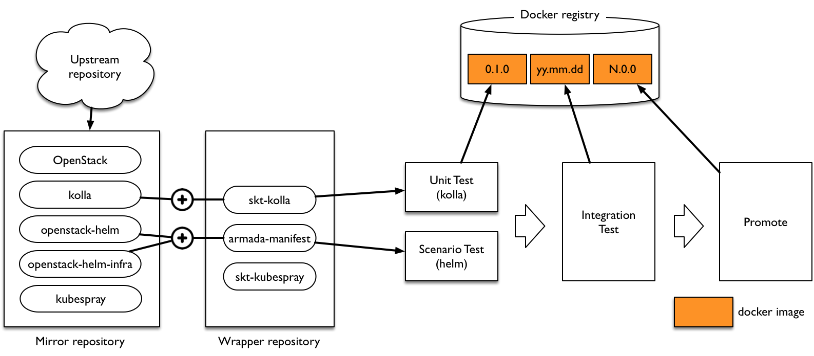

*********************************
TACO Continuous Integration 구조
*********************************

TACO CI 개요
============

TACO는 OpenStack을 포함한 다양한 오픈소스 소프트웨어 커뮤니티 버전의 소스코드를 기반으로 만들어진다. 따라서, 이러한 커뮤니티 소스코드에서 발생하는 많은 변경사항들을 지속적으로 가져와서 SKT 필요 부분을 추가하고 이를 테스트하여 안정적인 패키지를 만들어내는 과정, 즉 Continuous Integration 과정이 필요하다.

Continuous Integration (지속적인 통합)은 지속적으로 복잡한 소프트웨어의 Quality를 컨트롤하며 완성도 높은 결과물을 만들어내기 위한 대표적인 방법이다. 
즉, 작은 단위로 그리고 자주 통합해, 통합 시 발생하는 여러가지 문제점을 조기에 발견하고, 피드백 사이클을 짧게 하여 SW개발의 품질과 생산성을 향상 시키도록 한다. 

TACO에서는 위에 설명된 바와 같은 Continuous Integration 체계를 갖추고, SKT에서 필요한 다양한 테스트들을 자동으로 수행하여, 상용적용이 가능한 품질의 OpenStack을 지속적으로 만들어 낼 수 있도록 하고 있다.

TACO CI 구조
============

코드 저장소에 코드를 push하고 build 및 test를 거쳐 배포까지 하는 일련의 자동화된 과정이며 다음과 같은 특징이 있다.

* Upstream 코드 반영: Upstream 코드에 변경이 발생시마다 자체 기능 테스트를 수행하여 이상 없을 시 sync를 수행한다.
* 테스트: 코드를 push할 때마다 자동으로 단위 테스트를 수행하며, 매일 정기적으로 통합 테스트를 수행하여 artifact history를 관리한다.
* Profile 기반 자동화: 각 환경별 profile을 관리하여 서로 다른 형상의 다양한 환경에 deployment를 수행할 수 있다.

내부 저장소 관리
================

소스코드 저장소
---------------

소스 저장소는 크게 Upstream mirror repository와 Skt (wrapper) repository가 있다.

.. warning::

   소스 저장소 바꿔야할 듯

* Mirror repository: upstream source code를 주기적으로 sync하여 최신 상태를 유지한다.

   * openstack: openstack 소스코드
   * kolla: 각각의 openstack service들을 container화하기 위한 configuration
   * openstack-helm & openstack-helm-infra 생성된 container들을 kubernetes로 배포하기 위한 helm chart들
   * kubespray: kubernetes 설치를 위한 ansible playbook

* SKT Wrapper repository: kolla 및 helm chart 등에 대해 skt 추가, 변경사항 등을 포함한다.

Artifact 저장소
---------------

Artifact 저장소로는 Docker registry가 있다. 

* Docker registry:  각 테스트 단계에서 생성된 docker image들을 저장한다.

테스트 Flow
===========

단위 테스트
-----------

kolla, helm chart에 대해 mirror repository의 코드와 skt wrapper 내용을 함께 반영하여, 단위 테스트를 수행한다.

* kolla 단위 테스트: bats test 를 수행하여 docker image가 정상적으로 잘 build되었는지 테스트한다. 
* helm 단위 테스트: rally의 scenario test 를 수행하여 해당 openstack 서비스의 기본적인 기능이 잘 동작하는지 확인한다.

통합 테스트
-----------

unit test를 통과한 docker image와 helm chart 및 armada-manifest를 사용하여 통합 테스트를 수행한다.

* API Test: 미리 준비된 Kubernetes cluster에 전체 openstack 서비스를 배포한 후 tempest test를 수행하여 openstack API들이 잘 동작하는지 검증한다.
* Resiliency (HA) Test: 자체 개발한 Cookiemonster 라는 tool을 사용하여 random하게 특정 pod들을 down시키면서, 동시에 Rally scenario test를 수행하여 HA가 잘 동작하는지 검증한다.

Promote
-------

통합 테스트를 통과한 artifact들의 버전을 N.0.0 형식으로 promote하여 Production 환경에 대비한다.
