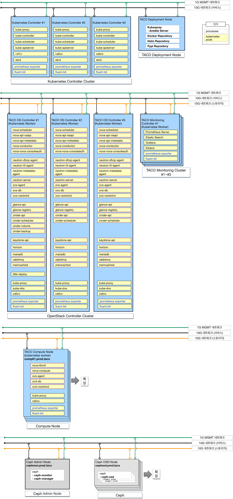
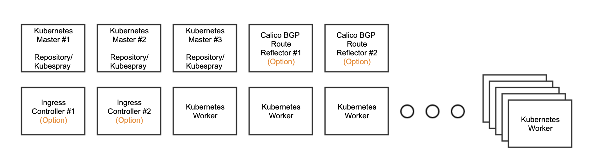
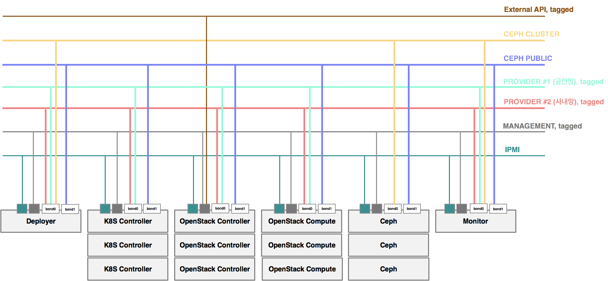
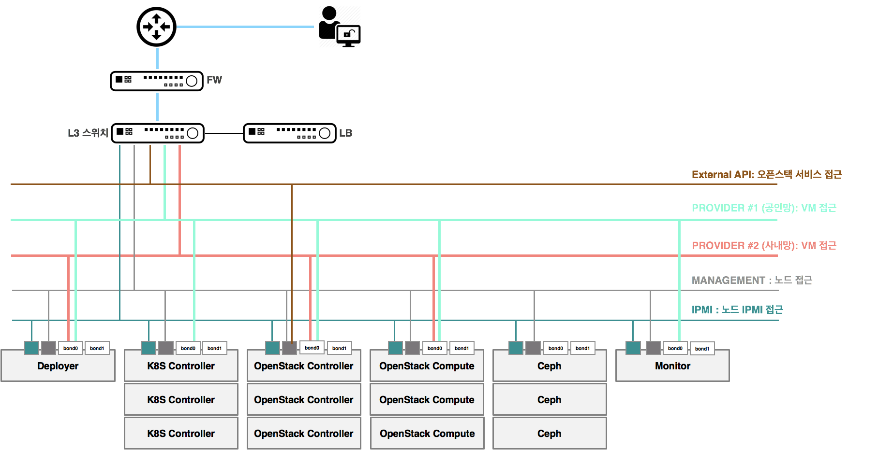
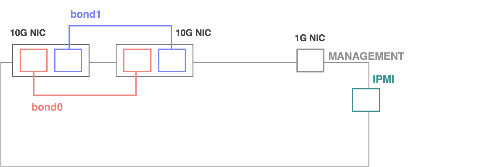
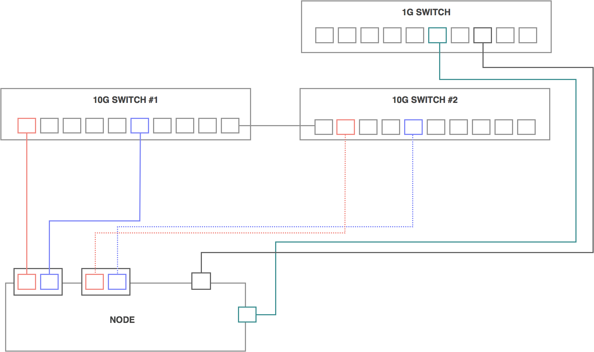
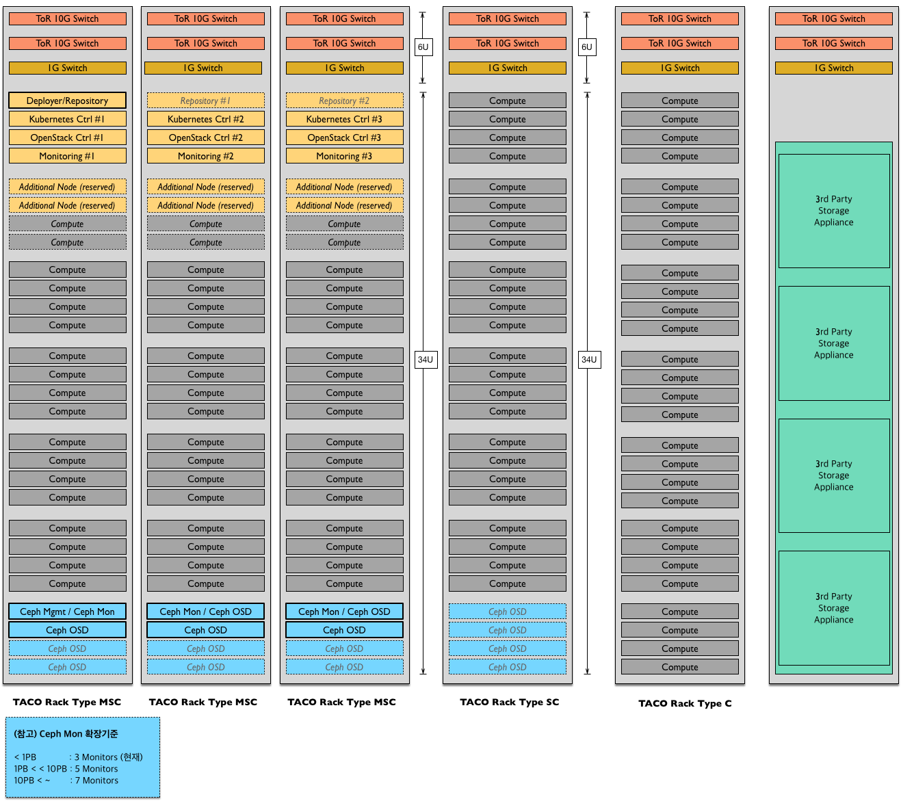
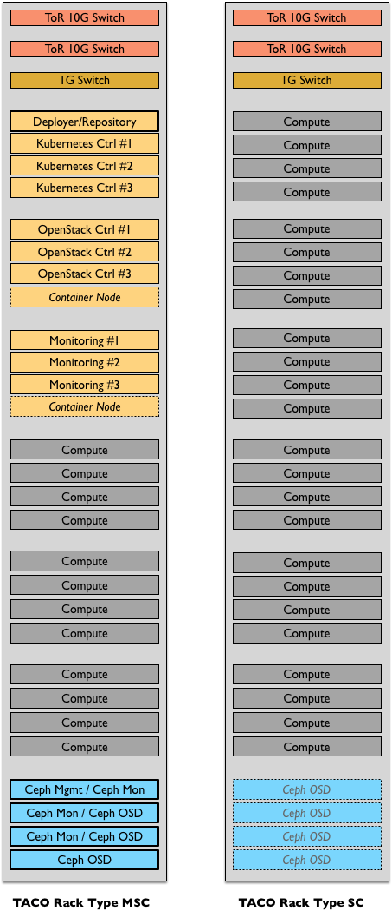

*********************
TACO Deployment 구조
*********************

TACO Full Deployment 형상 (예시)
=================================

TACO의 Deployment 구조 (하드웨어, 네트워크, 설치된 소프트웨어 형상)은 다음과 같다.

Deployment 형상은 사용되어지는 네트워크 모델, HA 형상, 스토리지 구조등에 따라서 변경될 수 있다.

TACO Kubernetes Only Deployment 형상 (예시)
===========================================

OpenStack 이 아닌, Kubernetes 만 단독으로 필요한 경우, 다음과 같은 형상으로 구성이 가능하다. 

* Kubernetes Master 는 기본적으로 3개 노드 클러스터로 구성이 되며, 규모가 대규모로 확장이 되는 경우, 성능과 안정성을 확보하기 위한 Master 노드 확장도 가능하다. 
* 100대 이상의 노드로 구성이 되는 경우, POD간 네트워크의 성능 보장 및 확장성 확보를 위하여 별도의 BGP Route Reflector 노드 구성이 필요할 수도 있다. 
* Ingress Controller 는 외부에서 Kubernetes 상에 배포되는 서비스들에 접근하는 것을 제어하며, 필요에 따라 별도로 구성도 가능하다. (기본적으로는 별도 구성이 되지 않는다) 
* 필요에 따라서, LMA (Logging, Monitoring, Alerting) 를 위한 EFK와  Prometheus 클러스터를 별도로 구성할 수도 있다.

Recommended Hardware 사양
=========================

아래 표는 Full HA 형상으로 설치 시 필요한 하드웨어 사양을 기술한다.

.. csv-table:: Recommended-Hardware
   :file: _static/recommended-hardware.csv
   :header-rows: 1

TACO에서 설치하는 SW프로세스 리스트 (예시)  
==========================================

참고: 설치되는 OpenStack 서비스 종류 혹은 네트워크/스토리지 구조에 따라서 아래 리스트는 변경될 수 있다. 

**Kubernetes Master Nodes (only kube-system)**

* calico-node
* kube-apiserver
* kube-controller-manager
* kube-proxy
* kube-scheduler

**OpenStack Controller Node**

.. warning:: 

   pcl20-stg??

* kube-system (ns)

   * calico-node
   * kube-proxy
   * nginx-proxy

* openstack (ns)

   * cinder-api
   * cinder-scheduler
   * glance-api
   * heat-api
   * heat-cfn
   * heat-engine
   * horizon
   * ingress
   * keystone-api
   * mariadb-ingress
   * mariadb-server
   * neutron-dhcp-agent
   * neutron-lb-agent
   * neutron-lbaas-agent
   * kubedns-autoscaler (only 1 on the cluster)
   * neutron-server
   * nova-api-metadata
   * nova-api-osapi
   * nova-conductor
   * nova-consoleauth
   * nova-novncproxy
   * nova-placement-api
   * nova-scheduler
   * pcl20-stg-etcd-etcd
   * pcl20-stg-memcached-memcached
   * pcl20-stg-rabbitmq-rabbitmq
   * ldap-0 (only 1 on the cluster)
   * elasticsearch-data
   * elasticsearch-master
   * elasticsearch-client
   * fluentbit
   * kibana
   * prometheus
   * kube-state-metrics
   * node-exporter
   * prometheus-openstack-exporter
   * alertmanager

**OpenStack Compute Nodes**

* kube-system (ns)

   * calico-node
   * kube-proxy
   * nginx-proxy
   * tiller-deploy (only 1 on the cluster)

* openstack (ns)

   * libvirt
   * neutron-lb-agent
   * nova-compute

예시: 네트워크 Deployment 구조
===============================

.. note::

   아래 설명된 네트워크 구조는 TACO를 Provider Network 모드로 구축하기 위해서 필요한 Physical Network 구성 예시이다.
   실제 구축시에는 TACO에서 사용되는 네트워크 모드 종류와 보안 및 서비스 요구사항에 따라서 최적화된 네트워크 설계가 필하다.

TACO Provider Network 구성도 (예시)
-----------------------------------

**필요 VLAN 구성 정보**

   * **IPMI**: 1G
   * **MANAGEMENT**: Kubernetes 클러스터링, 오픈스택 서비스 간 통신, 운영자 관리 용도, 1G, 이중화
   * **EXTERNAL API**: 포탈에서 오픈스택 API 접근 용도, 1G
   * **PROVIDER #1 (사내망)**: VM 용 공인망 네트워크, 10G
   * **PROVIDER #2 (공인망)**: VM 용 공인망 네트워크, 10G
   * **CEPH PUBLIC**: VM 및 Kubernetes 컨트롤러에서 스토리지 접근 용도, 10G
   * **CEPH CLUSTER**: CEPH 노드 간 클러스터링, 데이터 미러링 용도, 10G

TACO 외부접속을 위한 네트워크 구성도 (예시)
--------------------------------------------

호스트 인터페이스 구성 (예시)
-----------------------------

랙내 케이블링 (예시)
--------------------

예시: Deployment 랙 형상
========================

.. note::

   구축을 위한 랙 및 하드웨어 형상은 요구사항 (SLA, 가용한 투자비용, 초기 필요 용량등) 에 따라 변경될 수 있다. 
   TACO 구축은 All-In-One으로 하나의 노드에 설치하는 방법부터 가용성을 최대화하여 멀티랙에 설치하는 방법까지 다양하게 있을 수 있다. 
   이 부분은 상용 구축을 하고자 하는 부서와 함께 협력하여 해당 구축 사이트의 요구사항에 최적화된 구축 형상을 만들 필요가 있다.

최대한의 서비스 가용성 보장 (예시)
----------------------------------

* 3 Node HA Cluster로 구성되는 Management 노드들이 세 개의 랙에 배치됨에 따라서, 1개 랙에 장애가 발생할 경우에도 서비스 연속성을 보장한다. 
* Ceph도 기본 적으로 세 개의 Rack에 분산되어서 설치되며, 이에 따라서 Ceph-OSD가 분산되어 설치됨에 따라서, 랙 장애시에도 Ceph 서비스 연속성을 최대한 보장한다. 
* 초기 구성을 위해서 반드시 3개의 랙이 필요하다. 구체적으로는 다음과 같은 기본 장비들이 초기 구축시 준비되어야 한다.

   * TACO Rack Type MSC 3개
   * 10G 스위치 6식 (랙당 2식)
   * 1G 스위치 3식 (랙당 1식) 
   * Deployer Node 1개 (Repository를 별도 이중화로 구성할 경우, 2개 Node가 추가됨) 
   * Kubernetes Controller Node 3개 
   * OpenStack Controller Node 3개 
   * Ceph Node (6대 - OSD Node 갯수는 초기 필요 스토리지 용량에 따라서 조정 가능함) 
   * *옵션* - Monitoring Node 3개 (Elasticsearch, Kafka등 모니터링용 시스템을 위한 노드) 
   * *옵션* - 요구사항에 따라서 Container Node와 OpenStack Compute Node의 비율 조정이 가능함
   * *옵션* - 100대 이상 규모에서 Container Network의 확장성을 위해서 Calico BGP Route Reflector 역할을 하는 두 개 이상의 노드 추가 가능 

* 초기 3 랙 구성에서 확장을 할 경우, 확장 요건에 따라서 두 타입으로 나눌수 있다. 

   * TACO Rack Type SC: 컴퓨트와 스토리지를 같이 확장할 경우에 사용가능하며, 하나의 랙에 확장할 수 있는 Compute Node와 Ceph OSD Node가 위치한다. 

      * Compute Node와 Ceph OSD Node의 비율은 필요에 따라서 조정 가능하다. 

   * TACO Rack Type C: 컴퓨트만 확장할 경우 사용가능하며, 하나의 랙에 Compute Node들만 위치한다.  

초기 투자비용 최소 (예시)
--------------------------

* 하나의 랙으로 기본적인 OpenStack 서비스 제공이 가능하다.

* 초기 구성을 위해서 1개의 Rack이면 된다. 구체적으로는 다음과 같은 기본 장비들이 초기 구축시 준비되어야 한다.

   * TACO Rack Type MSC 1개 
   * 10G 스위치 2식 
   * 1G 스위치 1식
   * Deployer Node 1개 
   * Kubernetes Controller Node 3개 
   * OpenStack Controller Node 3개 
   * Ceph Node (4대 - OSD Node 갯수는 초기 필요 스토리지 용량에 따라서 조정 가능함) 
   * 옵션 - Monitoring Node 3개 (Elastic Search, Kafka등 모니터링용 시스템을 위한 노드) 
   * 옵션 - Container Node 2개 (Portal, Dashboard등 Kubernetes에 추가로 올릴 Admin 혹은 User용 APP들을 위한 별도 노드

참고: Deployment 순서
=====================

아래 그림은 TACO를 설치하기 위한 End-to-End 절차를 나타내고 있다.

* 인프라 준비

   * 1단계: Baremetal Provisioning (OS설치 및 설정) 을 수행하고 필요한 Host 설정을 한다.
   * 2단계: TACO Deployment 노드에서 TACO 설치에 필요한 Repository를 설치하고, Kubespray (Ansible 서버 포함)를 설치한다. 
   * 3단계: Deployment Node에 구성된 Repository에 OpenStack 컨테이너 이미지와 Helm Chart등 필요한 파일을 등록한다.
   * 4단계: 설치를 위하여 필요한 OpenStack 컨테이너 이미지들과 Helm Chart, 그리고 구축환경에 맞추어 작성된 구축 프로파일 (Armada Manifest) 을 확인한다. 구축 프로파일에는 OpenStack을 설치하고 서비스 가능상태로 만들기 위한 모든 설정값들이 들어가 있다.

* TACO 설치

   * 5단계: Ansible을 통해서 Ceph을 자동 설치한다. 설치 후에는 TACO 설치에 필요한 Ceph 파라미터들을 설정해준다. 
   * 6단계: TACO Installer를 이용하여 Single Command Line 명령어로 Kubernetes와 OpenStack 설치를 수행한다. 설치시에는 아래와 같은 작업들이 자동으로 수행된다. 

      * 컨테이너화된 OpenStack을 관리하기 위한 Underlying Platform인 Kubernetes를 Kubespray를 이용하여 자동 설치한다. 
      * OpenStack을 Kubernetes 상에 설치하기 위해 필요한 Initial Setup (Helm 설치 등)이 자동으로 진행된다. 
      * OpenStack 구축 프로파일 (Armada Manifest) 을 기반으로, Kubernetes 상에 OpenStack 이 자동 구축된다.

* 설치 후 검증

      * 7단계: 설치된 OpenStack 이상유무 검증 후, 구축을 완료한다. 참고로, 현재는 Ceph 노드들과 SONA Gateway 노드들은 기존과 같이 베어메탈상에 설치를 하여야 한다. 차후 버전에서는 이에 대한 컨테이너화 및 자동화를 진행할 계획이다.
