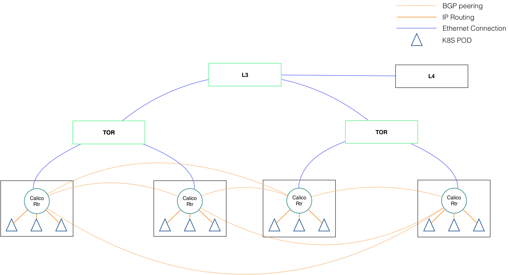

*****************************
TACO 매니지먼트 네트워크 구성
*****************************

TACO 매니지먼트 네트워크 구성 옵션
==================================

TACO는 Kubernetes 네트워크 드라이버로 Calico를 사용하고 있다. Calico는 BGP를 이용해 pod 간의 통신을 구현하고 있는데, 이를 위해 기본적으로 클러스터를 구성하는 모든 노드 간에 full mesh 형상으로 BGP peering을 맺게 된다. (옵션 1) 
이런 구성은 별도의 네트워크 전용 노드나 스위치 설정이 필요 없어 간편하지만, 클러스터의 규모가 100대 이상으로 늘어나면 BGP 운영에 과도한 리소스 소모와 컨트롤 트래픽이 발생할 수 있어 비효율적이다.
따라서, 100 노드 이상의 대규모 구축에는 BGP route reflector를 사용하는 것을 권장한다. Route reflector는 구축 환경에 따라 전용 노드를 사용할 수도 있고 (옵션 2) 상단의 aggregation 스위치를 활용할 수도 있다 (옵션 3).
장애 상황을 대비해 route reflector는 적어도 두 대 이상이 필요하다.

	옵션 1) Full Node-To-Node Mesh - 가장 Simple 하며 별도의 Route Reflector 를 사용할 필요가 없음. 
	옵션 2) Global BGP Peers - 별도의 서버를 Route Reflector로 활용
	옵션 3) Global BGP Peers - Aggregation Switch를 Route Reflector로 활용

Node-To-Node Mesh
-----------------

  

Global BGP Peers - 별도의 서버를 Route Reflector로 활용
-------------------------------------------------------

.. figure:: _static/man2.png

Global BGP Peers - Aggregation Switch를 Route Reflector로 활용
--------------------------------------------------------------

.. figure:: _static/man3.png

