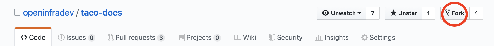
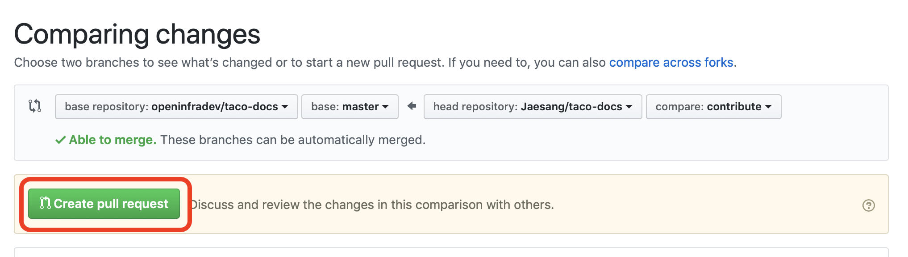

Contribute
==========

Repository
----------

* tacoplay: https://github.com/openinfradev/tacoplay
* 메뉴얼: https://github.com/openinfradev/taco-docs  

개발방법
--------

1. github의 tacoplay repository를 자신의 계정으로 포크합니다.

2. 포크한 repository를 다운로드 합니다.

.. code-block:: bash

    git clone https://github.com/<your-github-id>/tacoplay.git

3. 개발을 위해 새로운 브랜치를 만듭니다.

.. code-block:: bash

    git checkout -b <TOPIC-BRANCH>

4. 개발 / 테스트

5. 개발내용을 커밋하고 github에 푸쉬합니다.

.. code-block:: bash

    git commit -a
    git push origin <TOPIC-BRANCH>

6. tacoplay repository로 Pull Request를 합니다.

