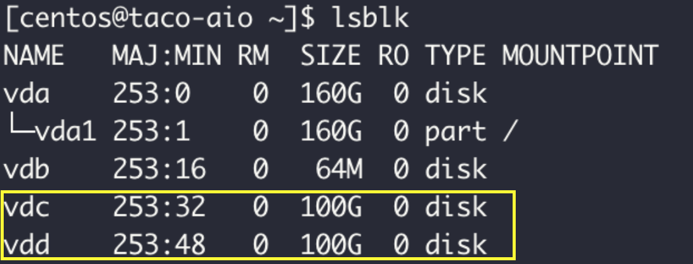
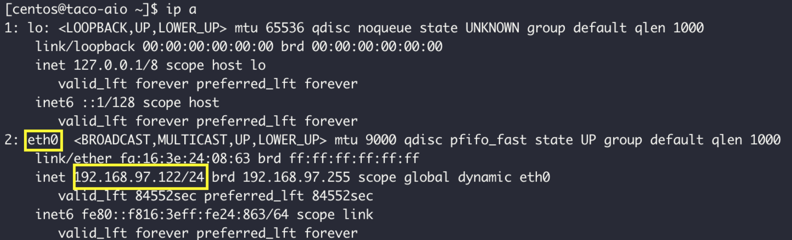
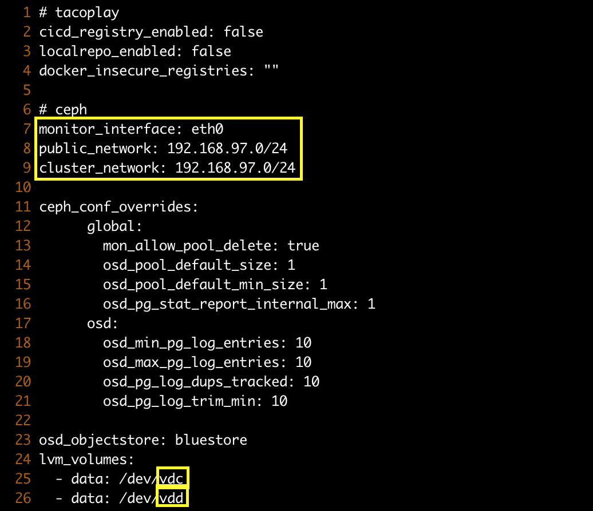
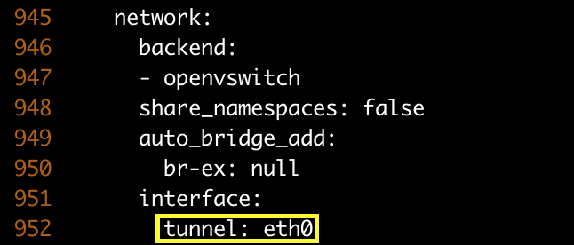
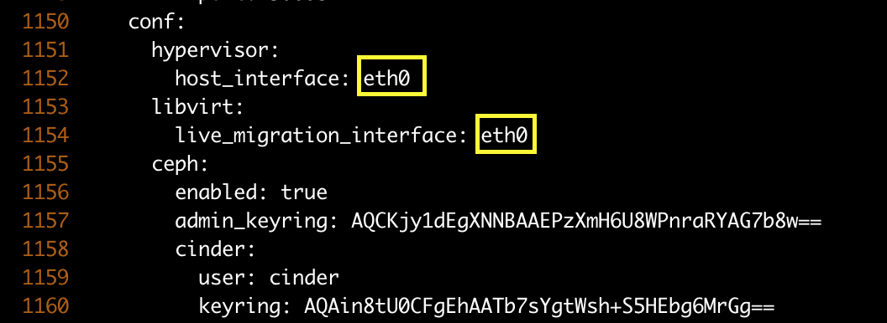
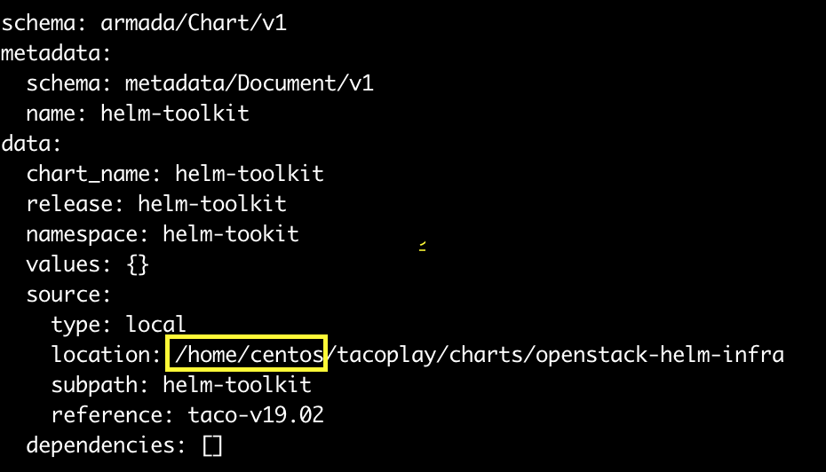
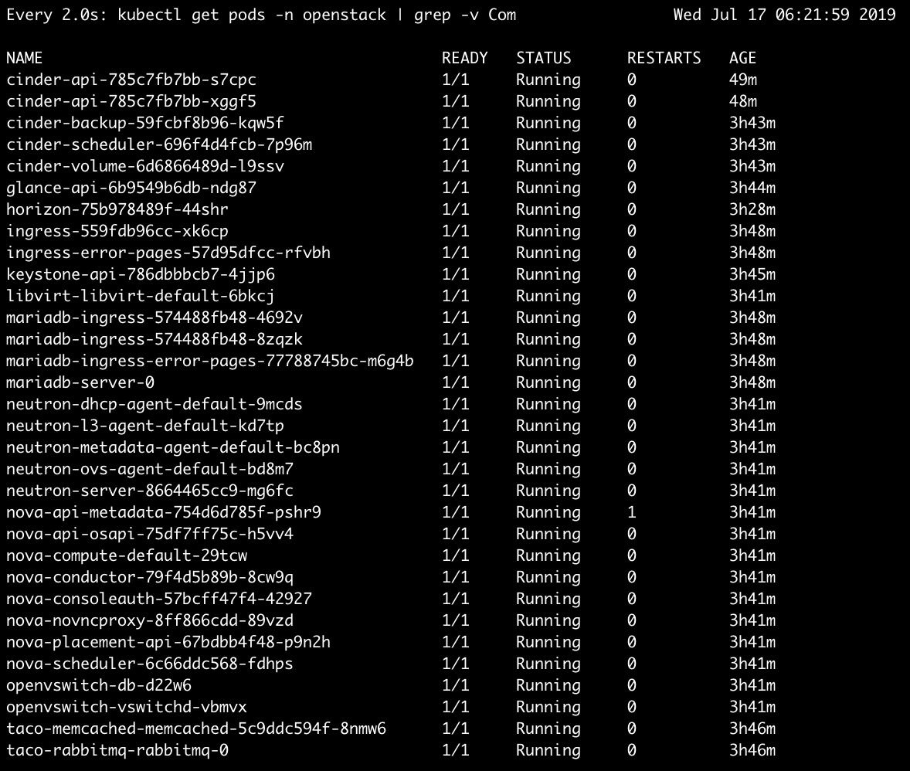
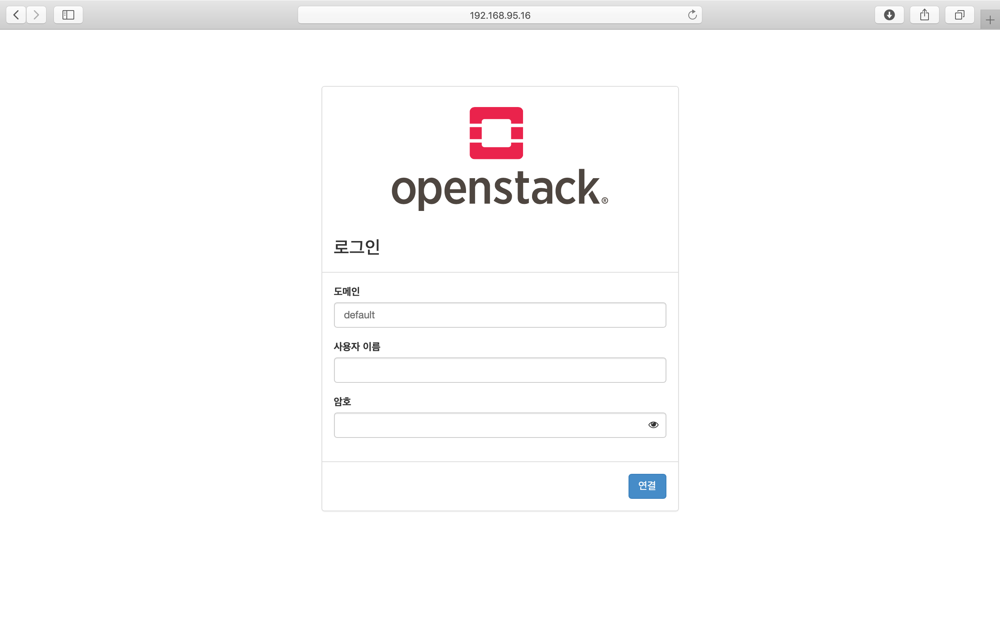

***********************
TACO install - aio node
***********************

테스트 환경 사양
================

이 매뉴얼은 다음 환경에서 테스트 한 것을 바탕으로 작성하였다.

* Flavor : m1.3xlarge 
* VCPU:8
* RAM: 24G
* Disk: 160G 
* OS: CentOS-7-x86_64-GenericCloud-1901

taco 유저 생성
==============

* 유저 생성

ssh 접속 시 사용할 taco 유저를 생성하고 사용할 패스워드를 입력한다.

.. code-block:: bash

   $ sudo adduser taco
   $ sudo passwd taco

|

* sudo 권한 설정

taco 계정에 패스워드 없이 사용할 수 있는 sudo 권한을 부여한다.

.. code-block:: bash

   $ sudo visudo
   ## Allow root to run any commands anywhere
   100 root    ALL=(ALL)       ALL
   taco  ALL=(ALL) NOPASSWD: ALL

|

* sshd_config 수정

외부에서 ID/Password 를 사용해 ssh 접속이 가능하도록 sshd-config 파일의 PasswordAuthentication yes 항목의 주석처리를 풀어준다.

.. code-block:: bash

   $ sudo vi /etc/ssh/sshd-config
   # To disable tunneled clear text passwords, change to no here!
   PasswordAuthentication yes

|

* sshd 재시작 및 재접속

수정한 sshd_config를 읽어오기 위해 sshd 재시작 후 기존 계정을 exit 하고 taco계정으로 재접속한다.

.. code-block:: bash

   $ sudo service sshd restart

|
|

tacoplay 설정
=============

* Tacoplay 받아서 준비하기

.. code-block:: bash

   $ sudo yum install -y git selinux-policy-targeted bridge-utils epel-release
   $ sudo yum install -y python-pip
   $ sudo pip install --upgrade pip==9.0.3
   $ git clone https://github.com/openinfradev/tacoplay.git
   $ cd tacoplay/
   
|

* 하위 프로젝트들 fetch

   * armada :  armada 설치에 필요한 소스
   * ceph-ansible : ceph 설치에 사용되는 ansible playbook
   * kubespray : kubernetes 설치에 사용되는 ansible playbook
   * charts : kubernetes위에 openstack을 배포하는 데 필요한 helm chart  

.. code-block:: bash

   $ ./fetch-sub-projects.sh
   
|

* ceph-ansible site.yml 생성

.. code-block:: bash

   $ cp ceph-ansible/site.yml.sample ceph-ansible/site.yml
   
|

* extra-vars.yml 파일 설명 

ansible-playbook 실행 시 필요한 변수 값을 정의한다.
 
| - monitor_interface, public_network, cluster_network, lvm_volumes 확인 후 적절한 값으로 수정 

ceph osd disk를 위하여 volume 2개를 새로 생성하고 vm과 연결해준다. 
lsblk 명령어를 통해 ceph에서 사용할 수 있는 디스크를 확인한다.

ip a 명령어로 host의 ip주소를 확인한다.

lsblk와 ip a 명령어를 통해 확인한 값들로 extra-vars.yml 파일의 monitor_interface, public_network, cluster_network, lvm_volumes를 변경

이때 public_network, cluster_network 를 호스트 네트워크 대역에 맞추어 설정한다. 

.. code-block:: bash

   $ cd ~/tacoplay/inventory/sample/aio
   $ vi extra-vars.yml

|

* armada-manifest.yaml 수정

.. code-block:: bash

   $ cd ~/tacoplay/inventory/sample/aio
   $ vi armada-manifest.yaml

|

호스트의 네트워크 설정에 맞게 openstack에 사용할 인터페이스를 수정해 주어야 한다. 

neutron chart의 ``data.values.network.interface.tunnel`` 을 host가 사용하는 interface이름으로 변경한다.

nova chart의 ``data.values.conf.hypervisor.host_interface`` 와 ``data.values.conf.libvirt.live_migration_interface`` 도 host의 interface 이름으로 변경한다.

모든 차트의 source 디렉토리 위치가 예시 파일로 주어진 armada-manifest.yaml에서는 /home/centos/tacoplay/...로 되어있다. 이를 자신의 환경에서 tacoplay가 설치되어 있는 경로로 수정 한다. 

.. code-block:: bash

   $ cd ~/tacoplay/inventory/sample/aio
   $ vi armada-manifest.yaml

ex)

|
|

OS 설정
=======

* 호스트 파일 설정

/etc/hosts 파일에서 127.0.0.1 ip에 taco-aio를 추가한다.

.. code-block:: bash

   $ sudo vi /etc/hosts
   ## TACO ClusterInfo
   127.0.0.1 taco-aio localhost localhost.localdomain localhost4 localhost4.localdomain4

|
|

TACO 설치
=========

* TACO playbook 실행에 필요한 패키지 설치 

.. code-block:: bash

   cd ~/tacoplay
   sudo pip install -r ceph-ansible/requirements.txt
   sudo pip install -r kubespray/requirements.txt --upgrade
   sudo pip install -r requirements.txt --upgrade
 
|  

* Taco 설치

.. code-block:: bash

   $ cd ~/tacoplay
   $ ansible-playbook -b -i inventory/sample/aio/hosts.ini -e @inventory/sample/aio/extra-vars.yml site.yml
   

| ansible-playbook 옵션 설명 
| -i : 사용할 inventory 파일 지정
| -e : 실행시간에 변수 값 전달

|
|

TACO 설치 확인
==============

* pod 확인

.. code-block:: bash

   $ kubectl get pods -n openstack   <- pod 상태 확인
   $ watch 'kubectl get pods -n openstack'   <- watch 명령어를 통해 pod의 상태를 실시간으로 확인
   $ watch 'kubectl get pods -n openstack | grep -v Com'   <- Completed 된 상태의 pod를 제외하고 실시간으로 확인

다음 사진과 같이 pod가 다 뜨게 되면 taco설치가 완료되었다. (kubectl get pods -n openstack | grep -v Com 실행결과)

|

* horizon 접속

http://IP:31000    <-배정받은 machine의 ip를 넣어준다.

| domain : default
| id : admin
| pw : password

|

* Network 설정

.. code-block:: bash
   
   #!/bin/bash
   sudo ip addr add 10.10.10.1/24 dev br-ex
   sudo ip link set br-ex up
   sudo iptables -A FORWARD -o br-ex -j ACCEPT
   sudo iptables -A FORWARD -o eth0 -j ACCEPT
   sudo iptables -t nat -A POSTROUTING -o eth0 -j MASQUERADE

|

* Openstack 설치 검증

.. code-block:: bash

   $ cd ~/tacoplay
   $ scripts/taco-test.sh
   

| 위의 script를 수행하면 다음과 같은 task들을 수행하여 Openstack이 정상 동작하는지 검증하게 된다.
| - (가상) Network 및 Router 생성
| - Cirros Image upload
| - SecurityGroup 생성
| - Keypair Import
| - VM 생성 후 floating IP 추가
| - Volume 생성 후 VM에 추가

|
|

VM 생성 후
==========

* 생성된 VM 확인하기

다음과 같은 명령어를 통해 taco-test 스크립트를 돌려 생성된 VM을 확인할 수 있다. 결과 Networks 란에서 생성된 VM 의 ip 주소를 확인한다.

.. code-block:: bash

   $ openstack server list
 
   > 결과
   +--------------------------------------+------+--------+------------------------------------+--------------+---------+
   | ID                                   | Name | Status | Networks                           | Image        | Flavor  |
   +--------------------------------------+------+--------+------------------------------------+--------------+---------+
   | 4dd41f3c-f230-4100-aaaf-3c58cc942463 | test | ACTIVE | private-net=172.30.1.7, 10.10.10.3 | Cirros-0.4.0 | m1.tiny |
   +--------------------------------------+------+--------+------------------------------------+--------------+---------+

|

* 생성된 VM에 접속, 외부 통신 확인

ssh로 VM 에 접속 후, 네트워크 접속 상태를 확인하기 위해 ping 테스트를 수행한다. 

.. code-block:: bash

   [root@taco-aio ~]# ssh cirros@10.10.10.3    #생성된 VM의 ip주소를 넣는다.
   $ ping 8.8.8.8
   PING 8.8.8.8 (8.8.8.8): 56 data bytes
   64 bytes from 8.8.8.8: seq=0 ttl=53 time=1.638 ms
   64 bytes from 8.8.8.8: seq=1 ttl=53 time=1.498 ms
   64 bytes from 8.8.8.8: seq=2 ttl=53 time=1.147 ms
   64 bytes from 8.8.8.8: seq=3 ttl=53 time=1.135 ms
   64 bytes from 8.8.8.8: seq=4 ttl=53 time=1.237 ms

|
|

Trouble Shoothing
=================

* Missing value auth-url required for auth plugin password

.. code-block:: bash

   $ . tacoplay/scripts/adminrc

