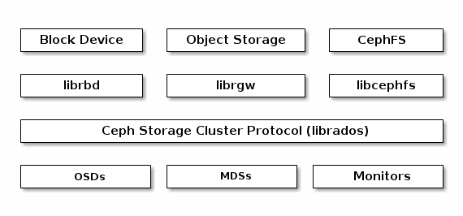
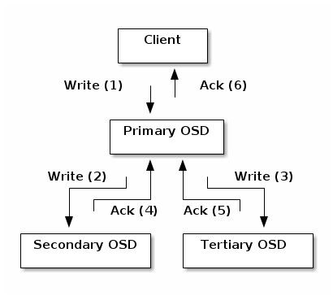
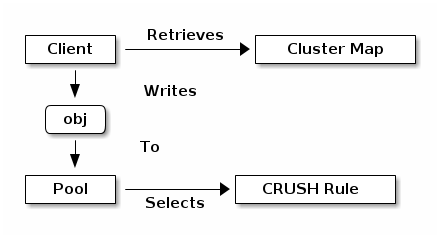
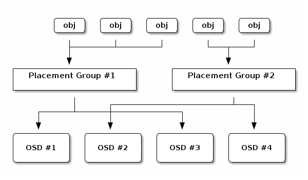
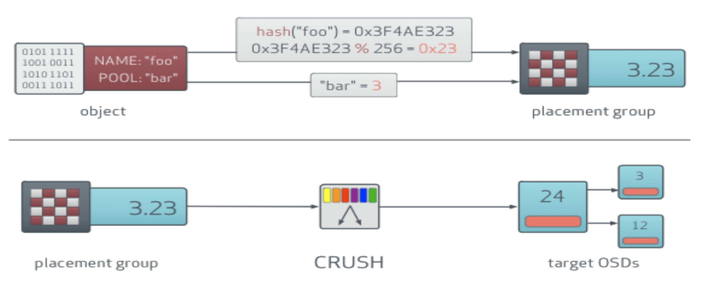
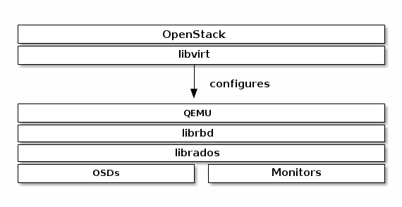

****
Ceph
****

Architecture
============

.. figure:: _static/ceph1.png

Components
==========

* Mon (Monitor Daemon) x 3: Cluster 관리, Client entry-point, Paxos 기반 합의 (최소 3개)
* Mgr (Manager Daemon) x 3: 통계 정보, 추가 모듈 제공 (dashboard, Prometheus exporter 등)
* OSD (Object Storage Daemon): OSD Disk 당 1개 (실제 Data 저장, 복제 등)

특징
====

기본 Data 저장 방식
-------------------

* 모든 데이터는 Object로 저장
* 가용성을 위해 Replication / Erasure Coding 지원: Strong consistency를 유지

Cluster Map
-----------

Ceph의 모든 컴포넌트와 사용자는 아래 5가지 Map을 바탕으로 클러스터의 멤버, 상태 및 변화 등을 인지 → Mon이 master copy 관리

* Monitor Map
* OSD Map
* PG Map
* CRUSH Map
* MDS Map

인증
----

사용자 별 Key 를 기반으로 인증 및 권한 관리

.. code-block:: yaml

   $ ceph auth list
   ...
   client.cinder
       key: AQAin8tU0CFgEhAATb7dfbseWsh+S5HEbg6MrGg==
       caps: [mon] profile rbd
       caps: [osd] profile rbd pool=volumes, profile rbd pool=backups, profile rbd pool=images
   ..

.. figure:: _static/ceph4.png

데이터 저장을 위한 자료구조
---------------------------

Pool:
-----

Ceph이 데이터를 저장하는 논리적인 공간

* Ownership/Access to Objects
* The Number of Placement Groups, and
* The CRUSH Rule to Use.

Placement Group (PG):
---------------------

데이터 배치는 object 단위가 아닌 PG 단위로 수행, Pool 마다 적정한 개수의 PG를 보유 (https://ceph.com/pgcalc/)

Object to OSD mapping
---------------------

.. code-block:: yaml

   $ ceph osd map volumes foo osdmap e103 pool 'volumes' (3) object 'foo' -> pg 3.7fc1f406 (3.6) -> up ([26,7,0], p26) acting ([26,7,0], p26)

시스템 연동
-----------

Openstack
---------

Copy-on-write clone 활용을 위해서 반드시 'raw' 형식 사용

* Glance
* Cinder

Kubernetes
----------

* External provisioner: 특정 스토리지 볼륨의 생성, 삭제 등 관리 주체
* Storage Class

.. figure:: _static/ceph9.jpg

명령어
------

.. code-block:: yaml

   $ ceph -s # 클러스터 상태 정보 요약
     cluster:
       id:     2e7d9617-1729-4763-ba7c-1f8736b2bbf4
       health: HEALTH_OK
  
     services:
       mon: 1 daemons, quorum ceph-1
       mgr: ceph-1(active)
       osd: 4 osds: 4 up, 4 in
  
     data:
       pools:   4 pools, 128 pgs
       objects: 65 objects, 256MiB
       usage:   4.53GiBused, 215GiB / 220GiB avail
       pgs:     128 active+clean
 
 
   $ ceph -s
     cluster:
       id:     2e7d9617-1729-4763-ba7c-1f8736b2bbf4
       health: HEALTH_WARN
               1 osds down
               Degraded data redundancy: 6 pgs undersized
  
     services:
       mon: 1 daemons, quorum ceph-1
       mgr: ceph-1(active)
       osd: 4 osds: 3 up, 4 in
  
     data:
       pools:   4 pools, 128 pgs
       objects: 65 objects, 256MiB
       usage:   4.53GiBused, 215GiB / 220GiB avail
       pgs:     122 active+clean
                6   active+undersized
 
 
$ ceph health detail # 문제 원인 파악
$ ceph df # 사용량 파악
$ ceph osd df

Troubleshooting
===============

Log 파일 위치: /var/log/ceph
----------------------------

* ceph.log: 전체 클러스터 로그
* ceph.audit.log: 작업 감사 기록
* ceph-mgr.<Node>.log: Ceph Manager Daemon
* ceph-mon.<Node>.log: Ceph Monitor Daemon
* ceph-osd.<OSD ID>.log: Ceph OSD Daemon
* ceph-volume.og: ceph-volume cli log

OSD 상태 정보
-------------

* Status: Up or Down & In or Out → 'Out'이 되는 시점에 클러스터 복구 등의 작업 수행 시작
	* Up
		* In (일반적인 상황)
		* Out (운영자가 명시적으로 설정하지 않는 다면 발생할 가능성 낮음)
	* Down
		* In (오류 발생 및 감지)
		* Out (In 에서 10분 경과 후 진입)
* OSD_DOWN: 특정 OSD 데몬이 비정상 상태, OSD 로그 파일: /var/lib/ceph/ceph-osd.*)
	* 원인
		* 데몬 자체가 버그 등의 오류 혹은 누군가의 실수로 종료됨
		* 네트워크 문제로 인한 OSD Peer 및 Monitor 와 연결 실패
		* OSD 데몬이 동작하는 호스트 전원 오류
		* OSD 데몬이 사용하는 디스크 오류
		* ...
* OSD_FULL: 하나 이상의 OSD 디스크 사용량이 full 설정 한계 값을 초과 → '쓰기' 작업 수행 실패
* OSD_BACKFILFULL: 하나 이상의 OSD 디스크 사용량이 backfillfull 설정 한계 값을 초과 (사전 경고) → '재배치' 작업 수행 실패
* OSD_NEARFULL: 하나 이상의 OSD 디스크 사용량이 nearfull 설정 한계 값을 초과 (사전 경고)
	* 'ceph df' 명령어를 통해 문제가 발생한 OSD 디스크 확인 가능

PG 상태 정보
------------

* PG_DEGRADED: 설정한 replica 수보다 적은 데이터 복제본이 유지 중인 상태 (degraded, undersized)
* PG_DEGRADED_FULL: 설정한 replica 수보다 적은 데이터 복제본이 유지 중이며 가용 공간 부족으로 인해 데이터 손실 가능 (backfull_toofull, recovery_toofull)
* PG_INACTIVE: 데이터 보호 등을 위해 해당 PG에 대한 Read/Write 방지 (replicated pool일 경우 복제본이 min_size 이하 일 때)
* PG_DAMAGED: 데이터 일관성 (consistency)에 문제 발생 (inconsistent, snaptrip_error) → 데이터 손실 가능성 높음
* TOO_FEW_PGS: 충분한 데이터 배치 및 성능을 위한 PG 개수 미달, 증가 필요
* TOO_MANY_PGS: 많은 PG 개수는 OSD 데몬의 메모리 사용량 증가, 느린 Peering 유발, Manager와 Monitor 부담 증가
* MANY_OBJECTS_PER_PG: 하나 이상의 Pool 사용량이 다른 나머지와 비교하여 현저하게 높음, TOO_FEW_PGS와 유사한 상황
* OBJECT_MISPLACED: 하나 이상의 오브젝트가 재배치 필요 (데이터 안전성에는 아무런 이상이 없음)
* REQUEST_SLOW: 하나 이상의 OSD에서 처리 과정이 오래 걸림 → 심한 부하, 스토리지 장치 성능 문제, Bug 등으로 발생
* REQUEST_STUCK: 하나 이상의 OSD에서 처리 자체가 중단, 심각한 오류

설치
====

* ceph-ansible: Ceph 클러스터 구축 (tacoplay/ceph-ansible)
* rbd_provisioner role: Kubernetes external provisioner 생성 및 Storage class 등록 (tacoplay/roles/rbd_provisioner)
* armada-manifest.yaml.j2: Openstack 연동 (inventory/XXX/armada-manifest.yaml.j2)

옵션 1) Ceph 신규 구축
----------------------

extra-vas.yml에 Ceph 설치 내역 정의

.. code-block:: yaml

   cluster: ceph # 생략 가능, 기본값: ceph
   monitor_interface: eth0
   public_network: 192.168.0.0/24
   cluster_network: 192.168.1.0/24
 
   ceph_monitors: 192.168.0.23,192.168.0.25,192.168.0.26
 
   ceph_stable_release: luminous
   osd_objectstore: bluestore
 
   ceph_conf_overrides:
     global:
       mon_allow_pool_delete: true
       mon_osd_down_out_subtree_limit: host
       osd_pool_default_size: 3
       osd_pool_default_min_size: 2
       osd_pg_stat_report_internal_max: 1
 
   openstack_config: true
   kube_pool:
     name: "kube"
     pg_num: 64
     pgp_num: 64
     rule_name: "replicated_rule"
     type: 1
     erasure_profile: ""
     expected_num_objects: ""
     application: "rbd"
   openstack_glance_pool:
     name: "images"
     pg_num: 64
     pgp_num: 64
     rule_name: "replicated_rule"
     type: 1
     erasure_profile: ""
     expected_num_objects: ""
   openstack_cinder_pool:
     name: "volumes"
     pg_num: 512
     pgp_num: 512
     rule_name: "replicated_rule"
     type: 1
     erasure_profile: ""
     expected_num_objects: ""
   openstack_pools:
     - "{{ kube_pool }}"
     - "{{ openstack_glance_pool }}"
     - "{{ openstack_cinder_pool }}"

옵션 2) 기존 Ceph 연동
----------------------

extra-vars.yml 에 Ceph Mon IP 주소와 user ID, Key 값을 지정

.. code-block:: yaml

   # ceph
   ceph_monitors: 192.168.99.01
   ceph_admin_keyring: ABCDEFGHJKAjEhAAUFQ1xmhsc7PccAx0r+NGPA==

   rbd_provisioner_admin_id: admin
   rbd_provisioner_secret: "{{ ceph_admin_keyring }}"
   rbd_provisioner_user_id: kube
   rbd_provisioner_user_secret: ABCDEFGHJAA4BhAACAaJLcqnmTHIFzS3cJwbAQ==

참고문서
========

* Ceph
	* http://docs.ceph.com/docs/master/
	* https://access.redhat.com/products/red-hat-ceph-storage
	* https://www.suse.com/solutions/software-defined-storage/ceph/
* Ceph-ansible
	* http://docs.ceph.com/ceph-ansible/master/
