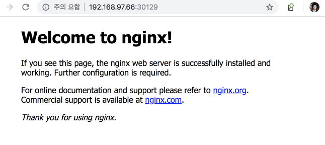

#####################
Helm / openstack-helm
#####################

****
helm
****

개념
====

Kubernetes의 패키지 매니저

링크: https://helm.sh/
   * Kubernetes 애플리케이션을 정의, 설치 및 업그레이드 할 수 있는 chart를 만들고 관리할 수 있도록 함.
   * chart 작성 표준에 맞춰서 chart를 작성한 후 repository에 넣어서 관리하고 kubernetes에 배포

작동 원리
---------

.. figure:: _static/helm1.png

TACO에는 kubespray에서 helm enable을 시켰기 때문에 tiller server는 kubernetes cluster 위에 올라가 있음

internet setting
----------------

일단 오픈소스를 할 때는 인터넷을 연결해봅시다.

.. code-block:: yaml

   $ sudo vi /etc/resolv.conf

   # openstack-helm 기본 image 다운로드를 위해 nameserver 추가
   nameserver 8.8.8.8

helm local repo setting
-----------------------

https://docs.helm.sh/using_helm/#quickstart

tiller server 설치 init

.. code-block:: yaml

   $ helm init --client-only

localhost에 helm chart repository server up serve

.. code-block:: yaml

   $ helm serve . &

add repo

.. code-block:: yaml

   $ helm repo add local http://localhost:8879/charts

   dependencies:
     - name: helm-toolkit
       repository: http://localhost:8879/charts
       version: 0.1.0

remove repo

.. code-block:: yaml

   $ helm search
   $ helm repo remove stable

helm chart 만들어보기
----------------------

chart 작성 표준

.. code-block:: yaml

   wordpress/
     Chart.yaml              # A YAML file containing information about the chart
     LICENSE                 # OPTIONAL: A plain text file containing the license for the chart
     README.md               # OPTIONAL: A human-readable README file
     requirements.yaml       # OPTIONAL: A YAML file listing dependencies for the chart
     values.yaml             # The default configuration values for this chart
     charts/                 # A directory containing any charts upon which this chart depends.
     templates/              # A directory of templates that, when combined with values,
                             # will generate valid Kubernetes manifest files.
     templates/NOTES.txt     # OPTIONAL: A plain text file containing short usage notes

helm create

.. code-block:: yaml

   $ cd ~
   $ helm create my-chart
   $ ls -al my-chart/
   total 16
   drwxr-xr-x.  4 centos centos   93 Feb 21 10:51 .
   drwx------. 14 centos centos 4096 Feb 21 10:51 ..
   drwxr-xr-x.  2 centos centos    6 Feb 21 10:51 charts
   -rw-r--r--.  1 centos centos  104 Feb 21 10:51 Chart.yaml
   -rw-r--r--.  1 centos centos  333 Feb 21 10:51 .helmignore
   drwxr-xr-x.  2 centos centos  106 Feb 21 10:51 templates
   -rw-r--r--.  1 centos centos 1062 Feb 21 10:51 values.yaml

helm install

.. code-block:: yaml

   # helm install [CHART] [flags]
   $ helm install my-chart --name test-chart
   NAME:   test-chart
   LAST DEPLOYED: Thu Feb 21 12:09:57 2019
   NAMESPACE: default
   STATUS: DEPLOYED

   RESOURCES:
   ==> v1/Service
   NAME                 AGE
   test-chart-my-chart  9s

   ==> v1beta2/Deployment
   test-chart-my-chart  9s

   ==> v1/Pod(related)

   NAME                                  READY  STATUS             RESTARTS  AGE
   test-chart-my-chart-69957864df-dkcdb  0/1    ContainerCreating  0         5s

   NOTES:
   1. Get the application URL by running these commands:
     export POD_NAME=$(kubectl get pods --namespace default -l "app.kubernetes.io/name=my-chart,app.kubernetes.io/instance=test-chart" -o jsonpath="{.items[0].metadata.name}")
     echo "Visit http://127.0.0.1:8080 to use your application"
     kubectl port-forward $POD_NAME 8080:80

확인

.. code-block:: yaml

   $ helm list
   NAME        REVISION    UPDATED                     STATUS      CHART           APP VERSION NAMESPACE
   my-chart    1           Thu Feb 21 12:03:53 2019    DEPLOYED    my-chart-0.1.0  1.0         default

   $ kubectl get po
   NAME                        READY   STATUS         RESTARTS   AGE
   my-chart-85847467b4-fx4bn   0/1     ErrImagePull   0          23s

수정

.. code-block:: yaml

   $ vi my-chart/value.yaml
   ...
   image:
     repository: nginx
     tag: stable
     pullPolicy: IfNotPresent
   ...

업그레이드

.. code-block:: yaml

   # helm upgrade [RELEASE] [CHART] [flags]
   $ helm upgrade test-chart my-chart
   Release "test-chart" has been upgraded. Happy Helming!
   LAST DEPLOYED: Thu Feb 21 12:11:43 2019
   NAMESPACE: default
   STATUS: DEPLOYED

   RESOURCES:
   ==> v1/Service
   NAME                 AGE
   test-chart-my-chart  1m

   ==> v1beta2/Deployment
   test-chart-my-chart  1m

   ==> v1/Pod(related)

   NAME                                  READY  STATUS             RESTARTS  AGE
   test-chart-my-chart-69957864df-dkcdb  0/1    ImagePullBackOff   0         1m
   test-chart-my-chart-84b7cd789c-45c5s  0/1    ContainerCreating  0         1s

   NOTES:
   1. Get the application URL by running these commands:
     export POD_NAME=$(kubectl get pods --namespace default -l "app.kubernetes.io/name=my-chart,app.kubernetes.io/instance=test-chart" -o jsonpath="{.items[0].metadata.name}")
     echo "Visit http://127.0.0.1:8080 to use your application"
     kubectl port-forward $POD_NAME 8080:80

확인

.. code-block:: yaml

   $ kubectl get po -o wide
   NAME                                   READY   STATUS    RESTARTS   AGE   IP              NODE      NOMINATED NODE
   test-chart-my-chart-84b7cd789c-45c5s   1/1     Running   0          78s   10.233.24.102   test0-2   <none>

   $ kubectl get svc
   NAME                  TYPE        CLUSTER-IP      EXTERNAL-IP   PORT(S)   AGE
   kubernetes            ClusterIP   10.233.64.1     <none>        443/TCP   9h
   test-chart-my-chart   ClusterIP   10.233.74.213   <none>        80/TCP    57s

   # connect to webserver

.. figure:: _static/helm2.png

노드포트 적용

.. code-block:: yaml

   $ helm upgrade test-chart my-chart --set service.type=NodePort
   Release "test-chart" has been upgraded. Happy Helming!
   LAST DEPLOYED: Thu Feb 21 12:21:05 2019
   NAMESPACE: default
   STATUS: DEPLOYED

   RESOURCES:
   ==> v1/Service
   NAME                 AGE
   test-chart-my-chart  11m

   ==> v1beta2/Deployment
   test-chart-my-chart  11m

   ==> v1/Pod(related)

   NAME                                  READY  STATUS   RESTARTS  AGE
   test-chart-my-chart-84b7cd789c-45c5s  1/1    Running  0         9m

   NOTES:
   1. Get the application URL by running these commands:
     export NODE_PORT=$(kubectl get --namespace default -o jsonpath="{.spec.ports[0].nodePort}" services test-chart-my-chart)
     export NODE_IP=$(kubectl get nodes --namespace default -o jsonpath="{.items[0].status.addresses[0].address}")
     echo http://$NODE_IP:$NODE_PORT

확인

.. code-block:: yaml

   $ kubectl get po -o wide
   NAME                                   READY   STATUS    RESTARTS   AGE   IP              NODE      NOMINATED NODE
   test-chart-my-chart-84b7cd789c-45c5s   1/1     Running   0          44m   10.233.24.102   test0-2   <none>

   $ kubectl get svc
   [centos@test0-1 ~]$ kubectl get svc
   NAME                  TYPE        CLUSTER-IP      EXTERNAL-IP   PORT(S)        AGE
   kubernetes            ClusterIP   10.233.64.1     <none>        443/TCP        9h
   test-chart-my-chart   NodePort    10.233.74.213   <none>        80:30129/TCP   45m

   $ kubectl get nodes -o wide
   NAME      STATUS   ROLES         AGE   VERSION   INTERNAL-IP     EXTERNAL-IP   OS-IMAGE                KERNEL-VERSION              CONTAINER-RUNTIME
   test0-2   Ready    master,node   9h    v1.12.3   192.168.97.66   <none>        CentOS Linux 7 (Core)   3.10.0-957.1.3.el7.x86_64   docker://18.6.1
   test0-3   Ready    master,node   9h    v1.12.3   192.168.97.68   <none>        CentOS Linux 7 (Core)   3.10.0-957.1.3.el7.x86_64   docker://18.6.1
   test0-4   Ready    master,node   9h    v1.12.3   192.168.97.53   <none>        CentOS Linux 7 (Core)   3.10.0-957.1.3.el7.x86_64   docker://18.6.1

helm fetch

.. code-block:: yaml

   $ helm repo add stable https://kubernetes-charts.storage.googleapis.com
   $ helm search
   ...
   stable/terracotta                       1.0.0           5.5.1                           Terracotta Ehcache is an improved version of Java's de fa...
   stable/testlink                         4.0.3           1.9.19                          Web-based test management system that facilitates softwar...
   stable/tomcat                           0.2.0           7                               Deploy a basic tomcat application server with sidecar as ...
   ...

   $ helm fetch stable/tomcat
   $ ls -al
   ...
   drwxr-xr-x.  4 centos centos        111 Feb 21 12:11 my-chart
   -rw-rw-r--.  1 centos centos       2705 Feb 21 11:57 my-chart-0.1.0.tgz
   drwxrwxr-x. 15 centos centos       4096 Feb 21 06:32 tacoplay
   -rw-rw-r--.  1 centos centos 6727062227 Feb 21 06:43 tacoplay-test.tar.gz
   -rw-r--r--.  1 centos centos       3763 Feb 21 13:26 tomcat-0.2.0.tgz

 $ tar zxvf tomcat-0.2.0.tgz
   tomcat/Chart.yaml
   tar: tomcat/Chart.yaml: implausibly old time stamp 1970-01-01 00:00:00
   tomcat/values.yaml
   tar: tomcat/values.yaml: implausibly old time stamp 1970-01-01 00:00:00
   tomcat/templates/NOTES.txt
   tar: tomcat/templates/NOTES.txt: implausibly old time stamp 1970-01-01 00:00:00
   tomcat/templates/_helpers.tpl
   tar: tomcat/templates/_helpers.tpl: implausibly old time stamp 1970-01-01 00:00:00
   tomcat/templates/appsrv-svc.yaml
   tar: tomcat/templates/appsrv-svc.yaml: implausibly old time stamp 1970-01-01 00:00:00
   tomcat/templates/appsrv.yaml
   tar: tomcat/templates/appsrv.yaml: implausibly old time stamp 1970-01-01 00:00:00
   tomcat/README.md
   tar: tomcat/README.md: implausibly old time stamp 1970-01-01 00:00:00

   $ ls -al tomcat
   total 16
   drwxrwxr-x. 3 centos centos   77 Feb 21 13:28 .
   drwxrwxr-x. 3 centos centos   44 Feb 21 13:28 ..
   -rwxr-xr-x. 1 centos centos  299 Jan  1  1970 Chart.yaml
   -rwxr-xr-x. 1 centos centos 4141 Jan  1  1970 README.md
   drwxrwxr-x. 2 centos centos   85 Feb 21 13:28 templates
   -rwxr-xr-x. 1 centos centos 1038 Jan  1  1970 values.yaml

helm delete

.. code-block:: yaml

   $ helm delete --purge $CHART_NAME

tiller log 확인

.. code-block:: yaml

   kubectl logs -f TILLER-POD-NAME -n kube-system

**************
openstack-helm
**************

개념
====

컨테이너화된 OpenStack을 Helm을 사용하여 Kubernetes상에 구축하고, Self-Healing, Upgrade, 확장등의 라이프 사이클 관리를 할 수 있도록 하는 프로젝트

링크: https://github.com/openstack/openstack-helm
        https://github.com/openstack/openstack-helm-infra

.. figure:: _static/helm4.png

#1
Container화된 OpenStack 서비스들을 Kubernetes에 설치하기 위해서 필요한 정보들을 Helm Chart에 정의
Helm Chart는 사용될 컨테이너에 대한 정보와 위치, 적용할 Configuration 값들, 그리고 Kubernetes에 어떠한 형태로 올릴지에 대한 정보를 모두 가지고 있다.
(참조: 현재 TACO에서는 OpenStack 서비스들에 대한 Container화는 OpenStack Kolla 프로젝트를 통해서 만들어지고 있다)

#2
Helm의 Tiller 서버가 Chart에 있는 정보들을 기반으로 Kubernetes API를 호출하여 실제 구축을 수행한다.

#3
Helm을 통해서 단일 서비스 (예: Nova)에 대한 설치, 업그레이드등의 작업을 수행할 수 있으며, 필요한 서비스들만을 조합하여 설치하는 것도 가능하다.

openstack-helm in tacoplay
==========================

openstack-helm, openstack-helm-infra에 있는 helm chart로 etcd, ingress, mariadb, rabbitmq, memcached, keystone을 배포

helm chart의 위치
-----------------

.. code-block:: yaml

   $ tree -L 2 charts/
   charts/
   ├── openstack-helm
   │   ├── barbican
   │   ├── ceilometer
   │   ├── cinder
   │   ├── congress
   │   ├── CONTRIBUTING.rst
   │   ├── doc
   │   ├── glance
   │   ├── heat
   │   ├── horizon
   │   ├── ironic
   │   ├── keystone
   │   ├── LICENSE
   │   ├── magnum
   │   ├── Makefile
   │   ├── mistral
   │   ├── neutron
   │   ├── nova
   │   ├── rally
   │   ├── README.rst
   │   ├── senlin
   │   ├── setup.cfg
   │   ├── setup.py
   │   ├── tempest
   │   ├── tests
   │   ├── tools
   │   ├── tox.ini
   │   └── zuul.d
   └── openstack-helm-infra
       ├── calico
       ├── ceph-client
       ├── ceph-mon
       ├── ceph-osd
       ├── ceph-provisioners
       ├── ceph-rgw
       ├── doc
       ├── elastic-apm-server
       ├── elastic-filebeat
       ├── elastic-metricbeat
       ├── elastic-packetbeat
       ├── elasticsearch
       ├── etcd
       ├── falco
       ├── flannel
       ├── fluent-logging
       ├── gnocchi
       ├── grafana
       ├── helm-toolkit
       ├── helm-toolkit-0.1.0.tgz
       ├── ingress
       ├── ingress-0.1.0.tgz
       ├── kibana
       ├── kube-dns
       ├── kubernetes-keystone-webhook
       ├── ldap
       ├── libvirt
       ├── lockdown
       ├── Makefile
       ├── mariadb
       ├── memcached
       ├── mongodb
       ├── nagios
       ├── nfs-provisioner
       ├── openvswitch
       ├── playbooks
       ├── postgresql
       ├── prometheus
       ├── prometheus-alertmanager
       ├── prometheus-kube-state-metrics
       ├── prometheus-node-exporter
       ├── prometheus-openstack-exporter
       ├── prometheus-process-exporter
       ├── rabbitmq
       ├── README.rst
       ├── redis
       ├── registry
       ├── roles
       ├── setup.cfg
       ├── setup.py
       ├── tiller
       ├── tools
       ├── tox.ini
       └── zuul.d

helm toolkit
------------

openstack-helm, openstack-helm-infra를 사용할 때 필요한 기본적인 툴(function)과 모든 차트에서 공통적으로 사용되는 기능들을 제공하는 toolkit

.. code-block:: yaml

   # helm chart 위치
   $ cd ~/tacoplay/charts/openstack-helm-infra/helm-toolkit
   $ tree -L 2
   .
   ├── charts
   ├── Chart.yaml
   ├── requirements.lock
   ├── requirements.yaml
   ├── templates
   │   ├── endpoints
   │   ├── manifests
   │   ├── scripts
   │   ├── snippets
   │   ├── tls
   │   └── utils
   └── values.yaml

helm-toolkit 사용 예제

.. code-block:: yaml

   # 모든 openstack service는 db init이 필요
   $ cat ~/tacoplay/charts/openstack-helm/keystone/templates/job-db-init.yaml
   {{- if .Values.manifests.job_db_init }}
   {{- $dbInitJob := dict "envAll" . "serviceName" "keystone" -}}
   {{ $dbInitJob | include "helm-toolkit.manifests.job_db_init_mysql" }}
   {{- end }}

   $ cat ~/tacoplay/charts/openstack-helm/neutron/templates/job-db-init.yaml
   {{- if .Values.manifests.job_db_init }}
   {{- $dbInitJob := dict "envAll" . "serviceName" "neutron" -}}
   {{ $dbInitJob | include "helm-toolkit.manifests.job_db_init_mysql" }}
   {{- end }}

helm package를 대신해서 make를 사용

.. code-block:: yaml

   $ cd ~/tacoplay/charts/openstack-helm-infra
   $ make helm-toolkit
   $ helm search
   NAME                CHART VERSION   APP VERSION DESCRIPTION
   local/helm-toolkit  0.1.0

keystone 훑어보기

.. code-block:: yaml

   $ tree -L 2 keystone/
   keystone/
   ├── Chart.yaml
   ├── requirements.yaml
   ├── templates
   │   ├── bin
   │   ├── configmap-bin.yaml
   │   ├── configmap-etc.yaml
   │   ├── cron-job-credential-rotate.yaml
   │   ├── cron-job-fernet-rotate.yaml
   │   ├── deployment-api.yaml
   │   ├── ingress-api.yaml
   │   ├── job-bootstrap.yaml
   │   ├── job-credential-setup.yaml
   │   ├── job-db-drop.yaml
   │   ├── job-db-init.yaml
   │   ├── job-db-sync.yaml
   │   ├── job-domain-manage.yaml
   │   ├── job-fernet-setup.yaml
   │   ├── job-image-repo-sync.yaml
   │   ├── job-rabbit-init.yaml
   │   ├── network_policy.yaml
   │   ├── pdb.yaml
   │   ├── pod-rally-test.yaml
   │   ├── secret-credential-keys.yaml
   │   ├── secret-db.yaml
   │   ├── secret-fernet-keys.yaml
   │   ├── secret-ingress-tls.yaml
   │   ├── secret-keystone.yaml
   │   ├── secret-ldap-tls.yaml
   │   ├── secret-rabbitmq.yaml
   │   ├── service-api.yaml
   │   └── service-ingress-api.yaml
   └── values.yaml

internet disable
----------------

.. code-block:: yaml

   $ sudo vi /etc/resolv.conf

   # nameserver 8.8.8.8
