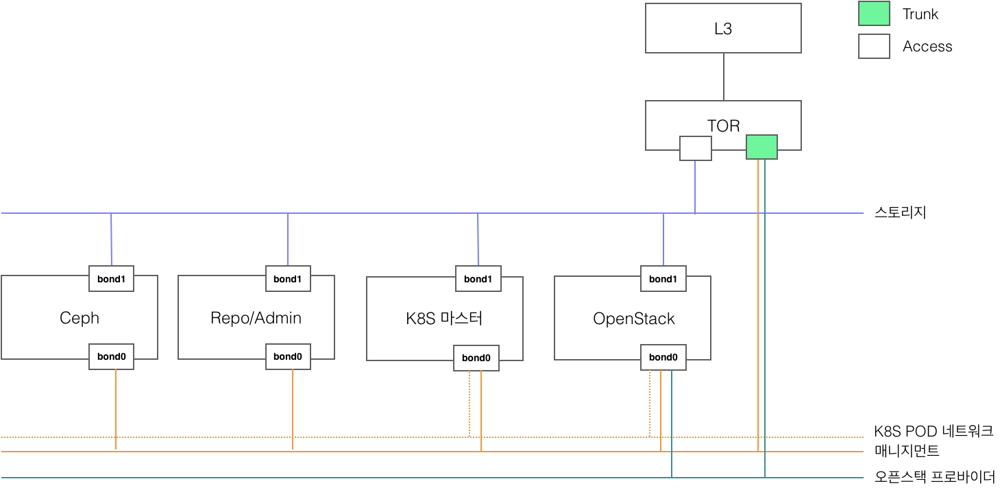

********
TACOPLAY
********

Introduction
============

tacoplay는 TACO를 구성하고 있는 다음의 소프트웨어들을 쉽게 설치하고 설정할 수 있게 해 주는 ansible playbook으로, 다양한 오픈 소스 프로젝트들과 자체 개발한 playbook들로 이뤄져 있다. 괄호 안은 해당 소프트웨어를 설치하는 데 사용하고 있는 주요 오픈 소스 프로젝트다. 

* Docker registry
* Ceph (ceph-ansible)
* Kubernetes (kubespray)
* Armada
* OpenStack (openstack-helm, openstack-helm-infra)
* Logging, Monitoring, Alarm (openstack-helm-infra)

주요 기능은 다음과 같다.

* 필요한 소프트웨어들을 한 번에 설치, 제거, 확장할 수 있는 통합 playbook 제공
* 각 소프트웨어의 정상 동작에 필요한 OS 설정 자동화
* 각 소프트웨어들 간의 통합 연동 설정
* 인터넷 접근이 불가능한 환경에서의 구축을 위한 설정 간소화

tacoplay 구성
=============

서브 프로젝트
-------------

* armada: armada 설치에 필요한 소스
* ceph-ansible: ceph 설치 자동화를 위한 ansible playbook
* :doc:`kubespray`: kubernetes 설치 자동화를 위한 ansible playbook
* charts: kubernetes위에 openstack을 배포하기 위한 helm chart

playbooks
---------

* ``site-prepare.yml``: 설치에 필요한 모든 리소스를 tar로 묶어줌(단, OS 패키지 및 python 패키지 제외)
* ``site-assert.yml``: 설정 검증
* ``site.yml``: 클러스터 설치
* ``armada-apply.yml``: 설치 후, armada manifest 설정만 변경/적용하고 싶은 경우에 사용
* ``scale.yml``: 클러스터 확장
* ``reset.yml``: 클러스터 삭제

roles
-----

* ``setup-os``: TACO 실행에 필요한 부가적인  OS 설정을 제공(local repo 설정, NAT/TC 룰 설정)
* ``docker``: docker 설치
* ``docker-registry``: TACO 설치에 필요한 docker 이미지들을 서비스 할 docker registry 컨테이너를 실행
* ``rbd_provisioner``: rbd 기반의 PV를 사용할 때 필요한 provisioner와 storage class를 생성
* ``admin-node``: ceph, kubectl, helm, openstack 등의 admin operation이 가능하도록 클라이언트 툴 설치 및 설정
* ``openstack/client``: openstack client 패키지를 설치하고, ingress를 통해 openstack 서비스 endpoint에 접근 가능하도록 호스트 파일 설정 추가
* ``openstack/setup-os``: openstack 실행에 필요한 커널 모듈 로드 및 부가적인 OS 설정
* ``openstack/preinstall``: openstack 배포 전에 k8s에 openstack namespace 및 cluster role binding 리소스 생성
* ``openstack/openstack-defaults``: taco에서 사용하는 openstack 기본 설정값 정의
* ``armada/install``: armada 설치
* ``armada/apply``: manifest template으로부터 armada-manifest.yml 파일 생성, 실제로 openstack을 배포하는 액션인 armada apply 명령을 실행

vars
----

* taco에서 사용하고 있는 기본 설정 값을 정의해 둔 것으로, 사이트 별 설정 적용은 vars 아래의 파일을 직접 수정하지 않고 extra-vars 파일을 통해 override 하도록 한다
* ``global_`` : 모든 사이트에 공통 적으로 적용해야 하는 설정

  * ``global_ceph.yml``: ceph-ansible 실행 시 적용할 기본 설정
  * ``global_docker.yml``: role/docker와 kubespray/roles/container-enbine/docker 실행 시 적용할 기본 설정
  * ``global_k8s-cluster.yml``: kubespray 실행 시 적용할 기본 설정
  * ``global_k8s-images.yml``: kubespray로 k8s 설치 시에 필요한 컨테이너 이미지 다운로드 URL 설정, local registry가 있는 경우에만 선택적으로 사용함
  * ``global_taco.yml``: taco playbook 및 role에서 정의하고 있는 value들의 모음

* ``site_specific.yml``: 사이트 별로 꼭 확인/적용해야 하는 value들의 모음

tests
-----

* ``adminrc``
* ``cirros-0.4.0-x86_64-disk.img``
* ``taco-test.sh``

인벤토리 구성 방법
==================

새로운 사이트 구축을 위한 인벤토리를 구성할 때는 기본적으로 아래의 세 가지 파일을 생성해 줘야 하며, 경우에 따라서는 group_vars나 hosts_vars를 추가해 주기도 한다.

* ``hosts.ini``
* ``extra-vars.yml``
* ``armada-manifest.yml``

hosts.ini 구성 방법
-------------------

호스트파일을 생성하기 위해서는 우선 클러스터를 구성하는 물리 노드들의 역할을 정해줘야 한다.

구축 형상 예시)

tacoplay에서는 크게 다음의 노드 그룹(역할)을 정의하고 있다. 여건에 따라 하나의 노드가 여러개의 역할을 수행해도 관계 없다.

* tacoplay

  * admin-node
  * registry
  * controller-node
  * compute-node

* ceph-ansible

  * mons
  * osds
  * mgrs
  * clients

* kubespray

  * etcd
  * kube-master
  * kube-node
  * kube-cluster 

TACO 클러스터를 구성하는 노드들의 역할을 먼저 정한 다음 그에 맞게 위에서 설명한 노드 그룹에 배치하면 된다. 부가적으로 k8s 설치 후 적용할 노드 라벨에 한해서만 설정 값을 hosts.ini에 정의해 주고 있다. 유의 할 점은, 그룹 별 라벨 설정 값은 자동으로 merge가 되지 않는다.

.. code-block:: yaml
   :caption: controller, compute노드가 모두 다른 경우
   :name: controller, compute노드가 모두 다른 경우

   [controller-node]
   ctrl01-prd
   ctrl02-prd
   ctrl03-prd
   
   [compute-node]
   com01-prd
   com02-prd
   
   [controller-node:vars]
   node_labels={"fluent-logging":"enabled", "node-exporter":"enabled", "openstack-control-plane":"enabled", "linuxbridge":"enabled"}
   
   [compute-node-r06:vars]
   node_labels={"fluent-logging":"enabled", "node-exporter":"enabled", "openstack-compute-node":"enabled", "linuxbridge":"enabled"}

.. code-block:: yaml
   :caption: controller, compute노드가 같은 경우
   :name: controller, compute노드가 같은 경우

   [controller-node]
   node01
   node02
   node03
   
   [compute-node]
   node01
   node02
   node03
   
   [controller-node:vars]
   node_labels={"fluent-logging":"enabled", "node-exporter":"enabled", "openstack-control-plane":"enabled", "openstack-compute-node":"enabled", "linuxbridge":"enabled"}

인벤토리를 구성하는 호스트의 그룹 별로 특정 설정 값을 다르게 적용해야 하는 경우 혹은 새로운 호스트 그룹을 추가해야 하는 경우 인벤토리 파일에 새로운 그룹을 정의해 주면 편하다. 아래는 rack04와 rack06 두 개의 랙으로 구성된 클러스터의 인벤토리 파일 구성 예시다.

.. code-block:: yaml
   
   (생략)
   
   # Kubernetes cluster
   [kube-master]
   master01-prd
   master02-prd
   master03-prd
   
   [etcd]
   master01-prd
   master02-prd
   master03-prd
   
   [kube-node]
   ctrl01-prd
   ctrl02-prd
   ctrl03-prd
   com01-prd-r06
   com02-prd-r06
   com11-prd-r04
   com12-prd-r04
   
   [rack06]
   master01-prd
   master02-prd
   master03-prd
   ctrl01-prd
   ctrl02-prd
   ctrl03-prd
   com01-prd-r06
   com02-prd-r06
   
   [rack04]
   com11-prd-r04
   com12-prd-r04
   
   (생략)

이렇게 정의 해 두면 rack04를 확장할 때 다음처럼 그룹 이름만 넘겨주는 것이 가능하다. 

.. code-block:: bash

   $ ansible-playbook -b -i inventory/product-vm/hosts.ini scale.yml --limit etcd,rack04

extra-vars.yml 설정 방법
------------------------

``extra-vars.yml`` 에는 기본적으로 ``vars/site_specific.yml`` 에 정의해 둔 설정 값을 사이트에 맞게 적어주면 된다. 특정 설정 값에 의존성이 있는 설정 값들도 있으므로 ``vars/site_specific.yml`` 을 잘 읽어보기를 권장한다.

.. csv-table:: extra-vars
   :file: _static/extra-vars.csv
   :header-rows: 1

group_vars 설정 방법
--------------------

노드 그룹 별로 설정 값을 다르게 줘야 하는 경우 인벤토리 디렉토리 아래에 group_vars 디렉토리를 만들고 ``group_name.yml`` 파일을 만들어 각 그룹에 적용할 설정 값을 추가하면 된다. 참고로 group_vars의 우선순위는 extra_vars 보다 낮기 때문에 group_vars에 정의한 값은 extra_vars에 존재하지 않도록 유의한다. 아래는 rack06과 rack04에 각각 다른 설정을 적용한 예시다.

.. code-block:: bash

   [taco@admin-prd tacoplay]$ ls -l inventory/lab-prd/group_vars/
   total 8
   -rw-rw-r--. 1 taco taco  79 Feb 20 16:21 rack04.yml
   -rw-rw-r--. 1 taco taco 121 Feb 20 16:21 rack06.yml
   
   [taco@admin-prd tacoplay]$ cat inventory/lab-prd/group_vars/rack06.yml
   # calico
   local_as: 64517
   peers:
     - as: 64517
       router_id: 192.168.95.2
     - as: 64517
       router_id: 192.168.95.3
   
   [taco@admin-prd tacoplay]$ cat inventory/lab-prd/group_vars/rack04.yml
   # calico
   local_as: 64518
   peers:
     - as: 64518
       router_id: 192.168.96.1

host_vars 설정 방법
-------------------

호스트 별로 설정 값을 다르게 줘야 하는 경우 인벤토리 디렉토리 아래에 host_vars 디렉토리를 만들고 ``host_name.yml`` 파일을 만들어 각 호스트에 적용할 값을 추가하면 된다. 마찬가지로 host_vars의 우선순위는 extra_vars 보다 낮기 때문에 host_vars에 정의한 값은 extra_vars에 존재하지 않도록 유의한다. 아래는 호스트 별로 다른 설정을 적용한 예시다.

.. code-block:: bash

   [taco@admin-prd tacoplay]$ cat inventory/dev/hosts.ini
   (생략)
   taco-ceph01 ip=90.90.230.26
   taco-ceph02 ip=90.90.230.27
   taco-ceph03 ip=90.90.230.28
   
   [taco@admin-prd tacoplay]$ ls -l inventory/dev/host_vars/
   total 12
   -rw-rw-r--. 1 taco taco 140 Feb 21 10:11 taco-ceph01.yml
   -rw-rw-r--. 1 taco taco 193 Feb 21 10:11 taco-ceph02.yml
   -rw-rw-r--. 1 taco taco 192 Feb 21 10:11 taco-ceph03.yml
   
   [taco@admin-prd tacoplay]$ cat inventory/dev/host_vars/taco-ceph01.yml
   # 1.92TB x 6
   lvm_volumes:
     - data: /dev/sdb
     - data: /dev/sdc
     - data: /dev/sdd
     - data: /dev/sde
     - data: /dev/sdf
     - data: /dev/sdg
   [taco@admin-prd tacoplay]$ cat inventory/dev/host_vars/taco-ceph02.yml
   # 1.92TB x 7 and 960GB x 1
   lvm_volumes:
     - data: /dev/sda
     - data: /dev/sdb
     - data: /dev/sdd
     - data: /dev/sde
     - data: /dev/sdf
     - data: /dev/sdg
     - data: /dev/sdh
     - data: /dev/sdi
   
   [taco@admin-prd tacoplay]$ cat inventory/dev/host_vars/taco-ceph03.yml
   # 1.92TB x 7 and 960GB x 1
   lvm_volumes:
     - data: /dev/sda
     - data: /dev/sdb
     - data: /dev/sdd
     - data: /dev/sde
     - data: /dev/sdf
     - data: /dev/sdg
     - data: /dev/sdh
     - data: /dev/sdi

Playbook Details
================

site-prepare.yml
----------------

``site-prepare.yml`` 은 taco 설치에 필요한 모든 컨테이너 이미지와 파일들을 tar로 묶어주는 기능을 한다.
인터넷이 없는 환경에서는 OS 패키지와 python 패키지 미러를 따로 구축하여야한다.

site.yml
--------

site assert
~~~~~~~~~~~

인벤토리를 검증하는 단계로, 빠진 설정이 없는지 확인하는 로직이 들어있다. 구축 담당자의 편의를 위해 사이트마다 꼭 확인해야 할 설정들은 ``vars/site_specific.yml`` 에서 "TACOFIXME"라는 값으로 오버라이드하고 있는데, 이런 값들은 사이트 인벤토리의 ``extra-vars.yml`` 파일에서 알맞은 값으로 꼭 오버라이드 해서 ansible-playbook 실행 시에 "-e" 옵션으로 넘겨 줘야 한다. 그렇지 않으면 site assert 단계에서 오류를 발생시켜 더 이상 진행되지 않는다. 

.. code-block:: yaml
   :caption: site.yaml

   # Assert inventory
   - import_playbook: site-assert.yml
     tags: assert
   
.. code-block:: yaml
   :caption: vars/site-specific.yml

   # set localrepo_yum, k8s, pypi as well when localrepo is enabled
   localrepo_enabled: TACOFIXME
   localrepo_yum: TACOFIXME
   localrepo_k8s: TACOFIXME
   localrepo_pypi: TACOFIXME
   
.. code-block:: yaml
   :caption: inventory/site/extra-vars.yml

   localrepo_enabled: true
   localrepo_yum: 192.168.95.11
   localrepo_k8s: 192.168.95.11
   localrepo_pypi: 192.168.95.11

.. code-block:: yaml
   :caption: site-assert.yaml
   
       - name: Assert localrepo urls are set properly
         assert:
           that: "{{ item }} != 'TACOFIXME'"
         with_items:
           - localrepo_pypi
           - localrepo_yum
           - localrepo_k8s
         when: localrepo_enabled
         tags: always

variable include
~~~~~~~~~~~~~~~~

Global 및 site specific variable을 적용한다. ``extra-vars.yml`` 은 ansible-playbook 실행 명령을 통해 적용하게 된다. 참고로 extra vars의 우선순위가 가장 높으며, 사이트 특수하게 적용하고 싶은 값은 extra-vars.yml이나 필요시 인벤토리 아래에 group_vars나 host_vars 디렉토리를 만들어 해당 그룹이나 호스트에만 설정 값을 적용하는 것이 가능하므로, tacoplay/vars 아래의 파일들은 가급적 수정하지 않도록 한다.

.. code-block:: yaml
   :caption: site.yaml

   - hosts: localhost:all
     any_errors_fatal: "{{ any_errors_fatal | default(true) }}"
     tasks:
       - name: include global override files
         include_vars: "{{ item }}"
         loop:
           - "{{ playbook_dir }}/vars/global_taco.yml"
           - "{{ playbook_dir }}/vars/global_docker.yml"
           - "{{ playbook_dir }}/vars/global_ceph.yml"
           - "{{ playbook_dir }}/vars/global_k8s-cluster.yml"
           - "{{ playbook_dir }}/vars/site_specific.yml"
   
       - name: include global override files
         include_vars: "{{ item }}"
         loop:
           - "{{ playbook_dir }}/vars/global_k8s-images.yml"
         when: groups['registry'] is defined and (groups['registry'] | length > 0)
     tags: always

populate hostname in hostfile
~~~~~~~~~~~~~~~~~~~~~~~~~~~~~

/etc/hosts 파일에 각 노드의 hostname을 추가한다. OpenStack nova-compute 실행에 필요한 설정 값으로 향후 role/openstack/setup-os로 옮기는 것이 맞다.

.. code-block:: yaml

   # Populate hostname to hosts file
   - hosts: taco
     any_errors_fatal: "{{ any_errors_fatal | default(true) }}"
     tasks:
       - name: make sure hostname is in hosts file
         replace:
           dest: /etc/hosts
           regexp: '^(127\.0\.0\.1(?!.*\b{{ inventory_hostname }}\b).*)$'
           replace: '\1 {{ inventory_hostname }}'
     tags: always

Prepare OS
~~~~~~~~~~

설정에 따라 OS에 TC, NAT 룰을 설정하고, firewalld 서비스를 disable 시키고(향후 선택적으로 활성화시키는 방법을 고려하는 것이 좋을 것 같다), local repo를 사용하는 경우 localrepo.repo 파일을 만들어 모든 노드의 /etc/yum.repo.d/ 아래에 복사한다.

.. code-block:: yaml

   - hosts: taco
     any_errors_fatal: "{{ any_errors_fatal | default(true) }}"
     roles:
       - { role: taco-defaults }
       - { role: setup-os }
     tags: setup-os

Docker registry
~~~~~~~~~~~~~~~

kubespray와 openstack 배포에 필요한 docker 이미지를 서비스하기 위한 작업이다. docker registry 서비스에 필요한 이미지는 tacoplay/docker_registry 아래에 포함되어 있다.

.. code-block:: yaml

   # Run docker registry
   - hosts: registry
     any_errors_fatal: "{{ any_errors_fatal | default(true) }}"
     roles:
       - { role: taco-defaults }
       - { role: docker }
       - { role: docker-registry }
     tags: registry

Install Ceph
~~~~~~~~~~~~

taco storage로 ceph을 사용하는 경우에 한해 ceph을 설치한다. 인벤토리 구성에 따라 ceph 클러스터를 새로 구축하기도 하고, 이미 구축된 ceph을 연동만 하는 경우 ceph client만 설치하기도 한다. 

.. code-block:: yaml

   # Install Ceph
   - import_playbook: ceph-ansible/site.yml
     tags: ceph
     when: taco_storage == 'ceph'

Install K8S
~~~~~~~~~~~

Kubernetes를 설치하고, admin 노드에 kubeconfig와 kubectl, helm 바이너리를 복사한다(참고로, 이후의 모든 k8s 리소스 생성은 admin-node에서 수행한다). 더불어 ceph을 사용하는 경우 rbd_provisioner를 생성하고, rbd 기반의 PV를 사용할 수 있도록 설정한다.

.. code-block:: yaml

   # Install K8S
   - import_playbook: kubespray/cluster.yml
     tags: k8s
   
   - hosts: taco
     roles:
       - { role: taco-defaults }
       - { role: admin-node }
     tags: k8s
   
   - hosts: admin-node
     any_errors_fatal: "{{ any_errors_fatal | default(true) }}"
     roles:
       - { role: taco-defaults }
       - { role: rbd_provisioner, when: rbd_provisioner_enabled }
     tags: k8s

OpenStack 배포 준비 및 배포
~~~~~~~~~~~~~~~~~~~~~~~~~~~

먼저 openstack 클러스터에 포함된 모든 노드를 대상으로 openstack 서비스에 필요한 OS 설정 작업을 한다. 즉, 필요한 kernel 모듈을 올리거나 /dev/kvm의 권한을 확인하는 등의 작업이 이뤄진다. 그리고 openstack 배포 툴로 사용하고 있는 armada를 admin 노드의 virtual env에 설치하고 armada/apply 과정에서 실제 배포 작업을 수행한다.

armada 설치가 완료되면, inventory 아래에 ``armada-manifest.yaml`` 이 존재하지 않는 경우 template으로부터 ``armada-manifest.yaml`` 을 생성해서 배포 명령을 실행한다. ``armada-manifest.yaml`` 이 존재한다면 template 작업은 생략한다. armada apply 명령을 실행한 후에는 openstack client 설정에 필요한 리소스(ingress controller pod)가 올라올 때 까지만 기다렸다가 openstack client 설치 및 openstack 서비스 접근을 위한 호스트파일 설정을 하고 site.yml playbook은 끝난다. 

.. code-block:: yaml

   # Tune system for OpenStack
   - hosts: controller-node:compute-node
     any_errors_fatal: "{{ any_errors_fatal | default(true) }}"
     roles:
       - { role: openstack/setup-os }
     tags: openstack
   
   # Prepare armada-manifests and then run armada apply
   - hosts: admin-node
     any_errors_fatal: "{{ any_errors_fatal | default(true) }}"
     roles:
       - { role: armada/install, tags: armada }
       - { role: openstack/pre-install, tags: openstack }
       - { role: openstack/openstack-defaults, tags: openstack }
       - { role: armada/apply, tags: armada }
   - hosts: admin-node:controller-node
     any_errors_fatal: "{{ any_errors_fatal | default(true) }}"
     roles:
       - { role: openstack/openstack-defaults }
       - { role: openstack/client }
     tags: openstack

armada-apply.yml
----------------

site.yml playbook을 적어도 한번 성공적으로 수행한 후(최소한 armada 설치까지), armada-manifest.yml만 수정해서 적용하고 싶은 경우 사용한다.

TODO) 설명 추가

scale.yml
---------

taco 구축 후 노드를 확장하고 싶은 경우 사용한다. 노드 확장 절차와 playbook 실행 명령은 Adding nodes with Kubespray를 참고한다.

TODO) 설명 추가

 
